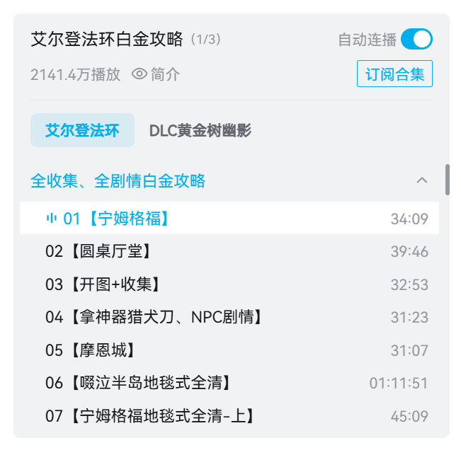

# 进阶使用

## 命名规则

通过变量和路径结构自定义文件的相对保存位置和名称，灵活满足不同整理需求。

### 适用下载类型
支持自定义命名规则的下载类型共五种：
- 投稿视频 - 普通
- 投稿视频 - 分P
- 投稿视频 - 合集
- 剧集 （番剧、电影、纪录片、国创、电视剧、综艺）
- 课程

::: details 💡 如何区分分P与合集视频
##### 分P视频
选集列表中带有“视频选集”字样。

##### 合集视频
合集拥有独立的标题，且支持“订阅合集”功能。

:::

### 基本语法与可用变量

在命名规则中，使用 `{变量名}` 可插入动态内容。程序会自动补充 `.mp4`、`.m4a` 等扩展名，**无需手动将其写进规则**。

::: details 🖱️ 点击展开查看可用变量一览表
| 变量格式 | 说明 | 示例渲染结果 |
| :--- | :--- | :--- |
| `{pub_time}` | 视频发布时间 | 2024-01-01（详见下方格式化说明） |
| `{pub_ts}` | 视频发布时间戳 | 1672531200 |
| `{create_time}` | 下载任务创建时间 | 2024-01-01（详见下方格式化说明） |
| `{create_ts}` | 下载任务创建时间戳 | 1672531200 |
| `{number}` | 解析列表中的编号 | 1 |
| `{uploader}` | UP 主昵称 | 哔哩哔哩番剧 |
| `{uploader_uid}` | UP 主 UID | 12345678 |
| `{aid}` | av 号 | av12345678 |
| `{bvid}` | BV 号 | BV1xxxxxx |
| `{cid}` | cid | 12345678 |
| `{ep_id}` | ep_id | 12345678 |
| `{season_id}` | season_id | 12345678 |
| `{leaf_title}` | 视频标题 / 分P小节标题 | 04 アルカテイル |
| `{parent_title}` | 分P视频的父标题 | 【KEY社20周年音乐专辑】Key BEST SELECTION |
| `{collection_title}` | 合集标题 | 艾尔登法环白金攻略 |
| `{section_title}` | 章节标题（未分章节则为空） | DLC黄金树幽影  |
| `{series_title}` | 剧集系列标题 / 课程标题 | 轻音少女 |
| `{season_title}` | 剧集季标题 | 轻音少女 第二季 |
| `{episode_title}` | 剧集单集标题 | 第18话 主角！ |
| `{season_number}` | 剧集季编号 | 2 |
| `{episode_number}` | 剧集集编号 | 18 |
| `{p}` | 分P序号 | 4 |

> **注**：不同下载类型支持的变量会存在差异，如果在特定分区的下载类型中该变量未生效，程序会自动忽略并剔除该变量。
:::

#### 日期变量格式化
`{pub_time}` 和 `{create_time}` 变量支持 Python 的 `strftime` 格式规范，实现个性化时间字符串。

| 格式化字符串 | 渲染结果示例 |
| :--- | :--- |
| `{pub_time:%Y-%m-%d}` | 2024-01-01 |
| `{pub_time:%Y年%m月%d日}` | 2024年01月01日 |
| `{pub_time:%Y-%m}` | 2024-01 |
| `{pub_time:%Y-%m-%d %H-%M-%S}` | 2024-01-01 12-00-00 |

#### 数字变量格式化
支持对 `{number}`、`{season_number}`、`{episode_number}` 和 `{p}` 等数字类型的变量进行格式化。**最常用的场景是前置补零**，这能确保文件在操作系统的本地文件中严格按序号顺序排列（避免出现 `1, 10, 2` 的错乱情况）。

| 格式化字符串 | 渲染结果示例 | 场景说明 |
| :--- | :--- | :--- |
| `{number:02d}` | `01` | 保持 2 位数，不足补零 |
| `{season_number:02d}` | `02` | 保持 2 位数，不足补零 |
| `{episode_number:03d}` | `018` | 保持 3 位数，不足补零 |
| `{p:04d}` | `0004` | 保持 4 位数，不足补零 |

### 创建文件夹与命名示例

你可以使用 `/` 来创建子文件夹（最右侧的 `/` 前面解析为目录，后面解析为文件名）。支持结合纯文本（如 `【B站】`）实现更高级的归类。

| 自定义规则 | 实际保存路径与文件名格式 | 场景说明 |
| :--- | :--- | :--- |
| `{uploader}_{leaf_title}` | `UP主昵称_视频标题.mp4` | 基础扁平化命名，防重名 |
| `{uploader}/{leaf_title}` | `UP主昵称/视频标题.mp4` | 按 UP 主自动创建独立文件夹 |
| `{bvid}/{p}_{leaf_title}` | `BVxxxxxxxx/1_分P标题.mp4` | 以 BV 号建档，对分P进行排序 |
| `{pub_time:%Y-%m}/{leaf_title}` | `2024-01/视频标题.mp4` | 按发布月份归类视频 |

### 注意事项

::: warning ⚠️ 路径与符号限制
1. **禁止的路径格式**：规则不能以 `/` 开头或结尾，且**严禁**出现连续的斜杠（如 `//`）。
2. **非法字符**：除了作为目录分隔符的 `/` 外，规则和最终解析的文件名中**不能包含系统不允许的特殊字符**（如 `\ : * ? " < > |`）。
:::

::: warning ⚠️ 收藏夹与个人空间的特殊说明
由于“收藏夹”和“用户个人空间”通常是各类视频类型的混合体（同时包含普通视频、分P视频、合集甚至剧集等），**无法使用单一的统配规则覆盖所有情况**。

因此，当你下载此类混合内容时：
1. 每种原始视频**均会自动回退使用其归属类型的默认命名规则**进行解析。
2. 在最终保存时，程序会在最外层**自动套上**一层以“收藏夹名称”或“UP 主昵称”命名的根文件夹以作归纳。
:::
