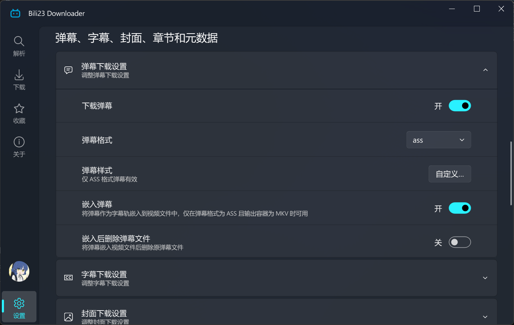
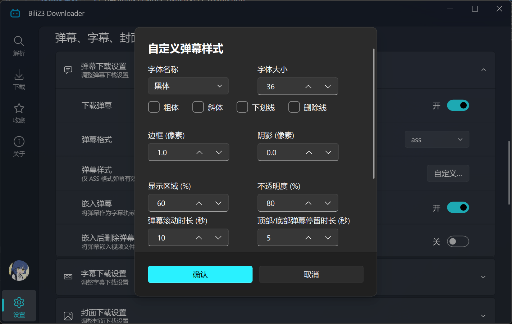
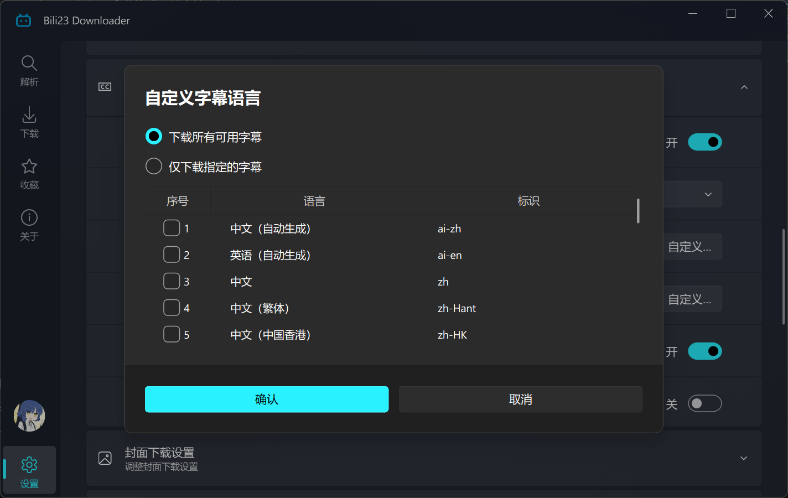

# 弹幕、字幕与封面

除视频本身外，程序还能下载弹幕、字幕、封面与章节信息。这些内容**默认都不下载**，需要先行开启。

## 开启方式

- **长期生效**：在 **[设置页] → [弹幕、字幕、封面、章节与元数据]** 中开启对应的开关。
- **仅本次生效**：在下载选项对话框的「附加内容」中临时勾选。

## 弹幕

| 格式 | 说明 |
| :--- | :--- |
| ass | 带样式的字幕格式，可直接被播放器加载显示，也是唯一能嵌入视频的格式 |
| xml | B站原始弹幕格式，需配合弹幕播放器或转换工具使用 |
| json | 原始数据，适合自行处理 |

### 弹幕样式

选择 ASS 格式后，可自定义弹幕的显示效果（**其他格式下该设置不生效**）：

- **字体**：字体名称、字号、粗体、斜体、下划线、删除线。
- **描边与阴影**：描边宽度、阴影大小。
- **显示效果**：弹幕占据的画面高度比例、不透明度、滚动弹幕停留时长、固定弹幕停留时长、弹幕之间的最小间隔。
- **分辨率**：弹幕画布的分辨率，建议与视频分辨率保持一致，否则字号看起来会偏大或偏小。

## 字幕

| 格式 | 说明 |
| :--- | :--- |
| ass | 带样式的字幕格式，唯一能嵌入视频的格式 |
| srt | 通用字幕格式，兼容性最好 |
| lrc | 歌词格式 |
| txt | 纯文本，只保留字幕内容 |
| json | 原始数据 |

### 语言选择

B站的字幕往往有多个语言版本，可以选择下载全部可用字幕，或只下载指定语言。

::: tip 💡 关于 AI 字幕
B站的部分字幕由 AI 自动生成，其语言名称与人工字幕完全相同。程序在嵌入视频时会为这类字幕轨附加「AI 生成」标注，避免播放器的字幕菜单里出现两条同名的「中文」而无法分辨。
:::

### 字幕样式

与弹幕相同，字幕样式**仅对 ASS 格式生效**，可调整字体、描边与阴影、字幕颜色（主要颜色、次要颜色、描边色、阴影色）、边距以及画布分辨率。

## 封面

可选 jpg、png、avif、webp 四种格式，开启后会在视频旁保存一份封面图。

若开启「嵌入封面」，封面会被写入视频文件作为内嵌封面，并可选择嵌入后删除原图。

## 章节

部分视频带有分段章节（B站播放器进度条上的分段标记）。开启「嵌入章节」后，这些章节会写入最终的视频文件，播放器中可直接跳转。

::: warning ⚠️ 章节的生效条件
章节信息通过 FFmpeg 写入文件，因此**只有存在合并步骤时才会生效**。另外，绝大多数视频并没有分段章节，此时不会产生任何章节信息，属于正常现象。
:::

## 嵌入的前置条件

「嵌入」是指把内容写进视频文件本身，而不是在旁边多放一个文件。各类内容的嵌入条件并不相同：

| 内容 | 嵌入条件 |
| :--- | :--- |
| 弹幕 | 格式为 **ASS**，且输出容器为 **MKV** |
| 字幕 | 格式为 **ASS**，且输出容器为 **MKV** |
| 封面 | 无格式限制 |
| 章节 | 存在合并步骤 |

::: warning ⚠️ 嵌不进去？先检查这两项
弹幕与字幕的嵌入开关，在格式不是 ASS 或输出容器不是 MKV 时会被静默跳过——文件照常下载，但不会写进视频。请到 **[设置页] → [下载]** 把输出容器格式改为 **mkv**，并把弹幕 / 字幕格式设为 **ass**。

此外，所有嵌入操作都在合并阶段完成，因此必须开启「合并视频和音频」。
:::

::: tip 💡 提示
嵌入后可分别选择是否删除原始的弹幕 / 字幕 / 封面文件。若希望同时保留独立文件（例如换播放器时使用），保持删除选项关闭即可。
:::

## 文件命名

附加文件会与视频同名，并加上类型后缀，因此不会与视频文件混淆：

| 内容 | 文件名示例 |
| :--- | :--- |
| 视频 | `视频标题.mp4` |
| 弹幕 | `视频标题.弹幕.ass` |
| 字幕 | `视频标题.字幕.zh-CN.srt` |
| 封面 | `视频标题.jpg` |
| 元数据 | `视频标题.元数据.nfo` |

字幕文件名中会带上语言代码，多语言字幕同时下载时不会互相覆盖。视频文件名本身由命名规则决定，详见 [自定义命名与归类](./naming-rule.md)。
