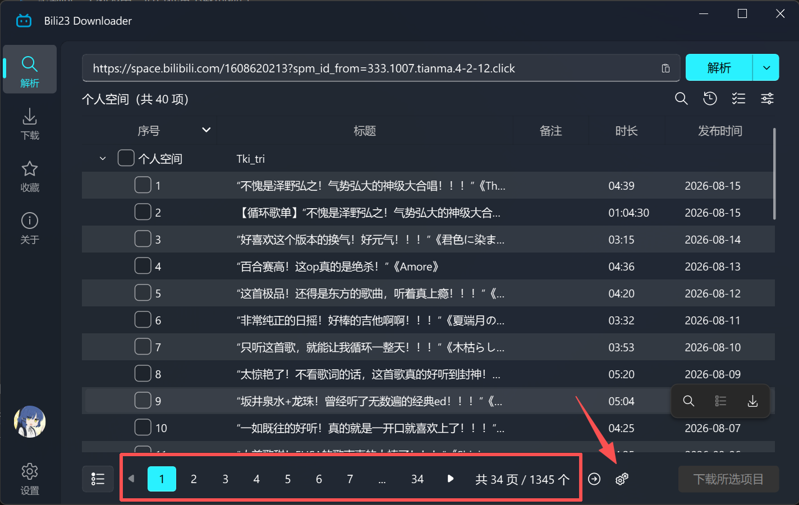
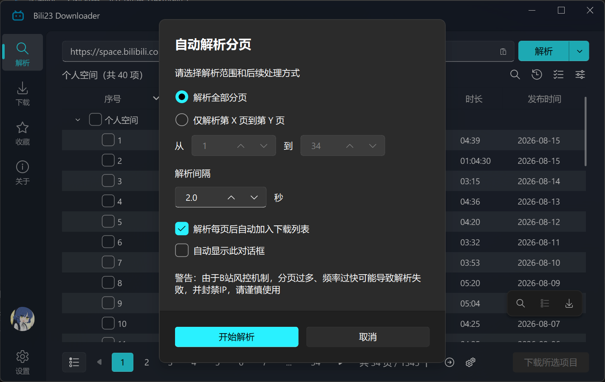
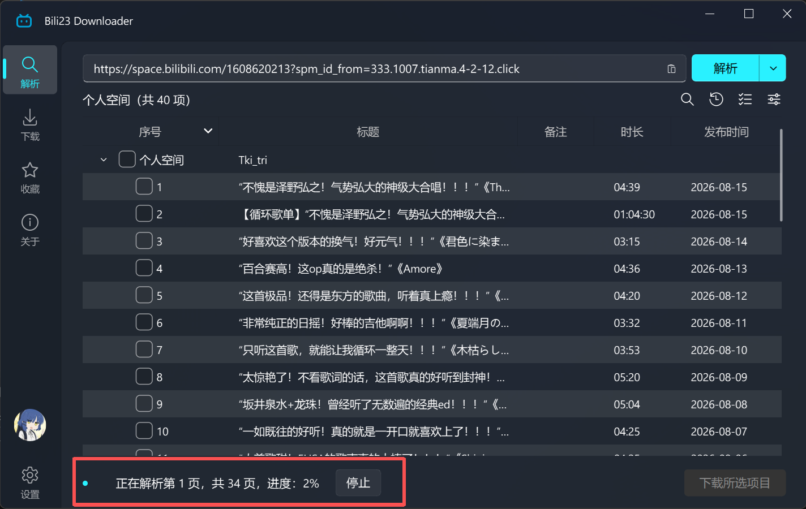

# 自动解析分页

解析收藏夹、个人空间、历史记录、稍后再看、合集等内容时，接口一次只返回一页。启用自动解析分页后，程序会按设定的范围逐页解析并汇总到同一个列表中，适合批量下载的场景。

## 触发入口

当解析结果存在分页时，界面底部会出现分页组件，其右侧的自动化图标即为自动解析分页的入口。

::: tip 💡 提示
若解析出的内容超过一页，程序会在首次使用时于该按钮旁给出气泡提示。你也可以在下方的选项中开启「自动显示此对话框」，之后每次解析到多页内容都会自动弹出该对话框。
:::

## 功能说明

对话框中的各项选项含义如下：

| 选项 | 说明 |
| :--- | :--- |
| 解析全部分页 | 从当前所在页一直解析到最后一页 |
| 仅解析第 X 页到第 Y 页 | 自行指定起止页码，起始页不得大于结束页 |
| 解析间隔 | 每解析完一页后的等待时间，可设置 0.1 ~ 15.0 秒 |
| 每页解析完成后自动加入下载列表 | 每解析完一页就把该页内容加入下载列表，无需等待全部解析结束 |
| 自动显示此对话框 | 之后解析到多页内容时自动弹出该对话框 |

设置会在关闭对话框时一并保存，下次打开仍沿用上次的值。

## 解析过程

点击「开始解析」后，分页组件会隐藏，界面底部改为显示解析进度，并附带一个「停止」按钮，可随时中止后续分页的解析，已解析出的内容会保留在列表中。

::: tip 💡 与关键词搜索配合
个人空间、收藏夹、历史记录、稍后再看这几类内容支持 [按关键词搜索](./keyword-search.md)，搜索状态下再执行自动解析分页，解析的即是搜索结果的全部分页。
:::

::: warning ⚠️ 注意
受B站风控机制影响，分页数量过多、请求过于频繁可能导致解析失败，严重时会造成 IP 被封禁，请谨慎使用，并适当调大解析间隔。
:::
