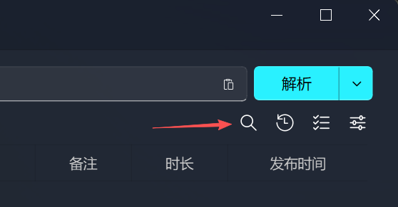
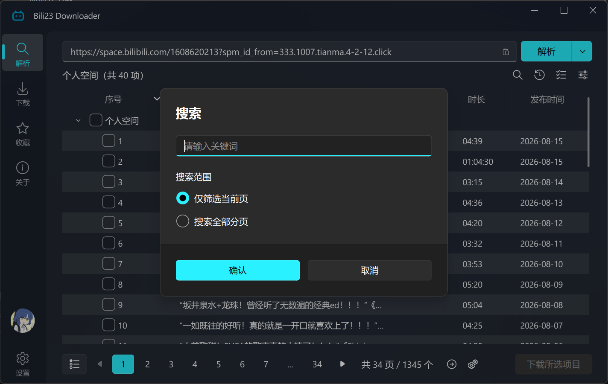
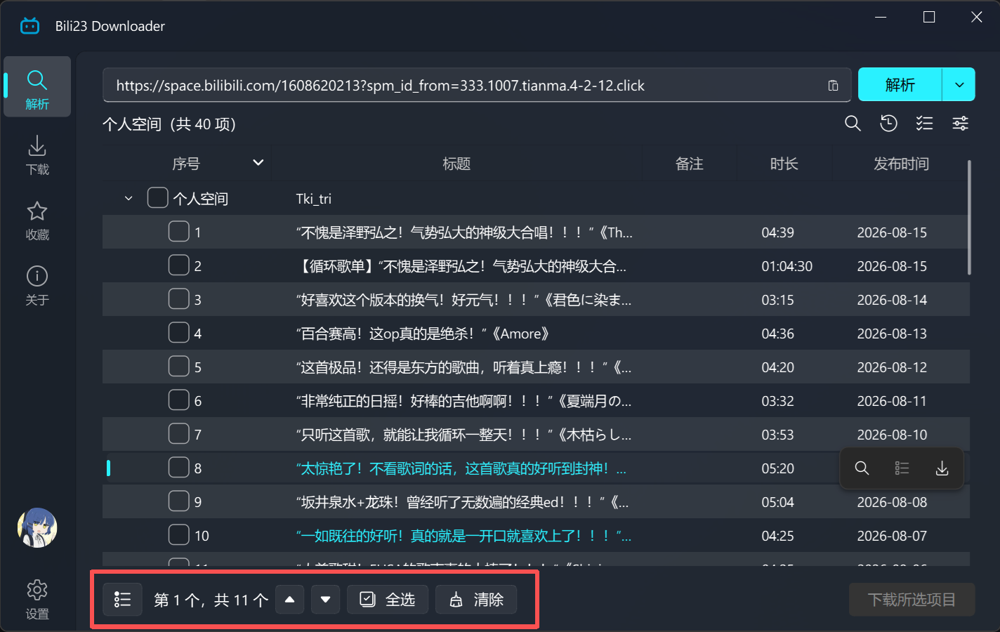
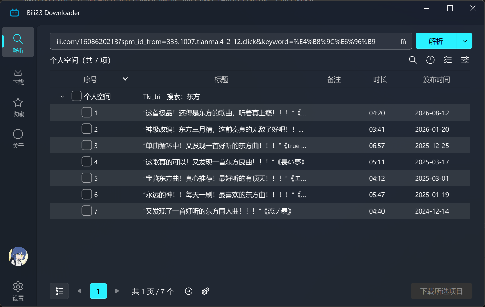

# 按关键词搜索

当解析结果条目较多时（例如个人空间投稿、收藏夹、合集、番剧剧集列表），可以使用关键词搜索快速定位需要的内容，并一键选中全部匹配项加入下载。

## 触发入口

搜索入口位于解析列表右上角的工具栏，点击放大镜按钮即可打开搜索对话框；也可以直接按快捷键 `Ctrl + F` 打开。

## 搜索范围

本程序提供两种搜索方式，打开对话框后会根据当前解析的内容类型，自动决定可用的方式。

| 搜索方式 | 作用范围 | 结果来源 | 适用内容 |
| :--- | :--- | :--- | :--- |
| 筛选当前页 | 仅当前已解析出的列表 | 本地匹配 | 全部内容 |
| 搜索全部分页 | 该链接下的全部内容 | 由B站提供 | 个人空间、收藏夹、历史记录、稍后再看 |

### 筛选当前页

在当前已解析出的列表中按标题匹配，不区分大小写，只要标题包含关键词即视为匹配。

搜索后，列表会自动展开并跳转到第一个匹配项，所有匹配项以高亮颜色显示，同时底部会出现搜索工具栏：

- **上一个 / 下一个**：在匹配项之间依次跳转，并显示当前所处的位置（如 1/11）。
- **全选**：一次性勾选全部匹配项，随后即可直接加入下载。
- **清除**：清除搜索结果，恢复列表的正常显示。

::: tip 💡 提示
筛选只针对已经解析出来的内容。如果当前内容存在分页，而该分页类型又不支持"搜索全部分页"（例如合集），筛选结果只覆盖当前这一页。此时可以先通过 [自动解析分页](./auto-parse-page.md) 解析出全部分页，再进行筛选。
:::

### 搜索全部分页

个人空间、收藏夹、历史记录、稍后再看这四类内容的接口本身支持搜索，因此可以选择"搜索全部分页"，把关键词交由B站检索，结果不再受当前页限制。

选择该方式后，程序会带着关键词重新解析，返回的即是搜索结果列表。此时的翻页、[自动解析分页](./auto-parse-page.md) 都会沿用该关键词，无需重复输入。

::: tip 💡 提示
关键词留空并确定，即可清除搜索状态，重新解析出完整的列表。再次打开搜索对话框时，输入框会回显当前正在生效的关键词，便于直接修改。
:::
