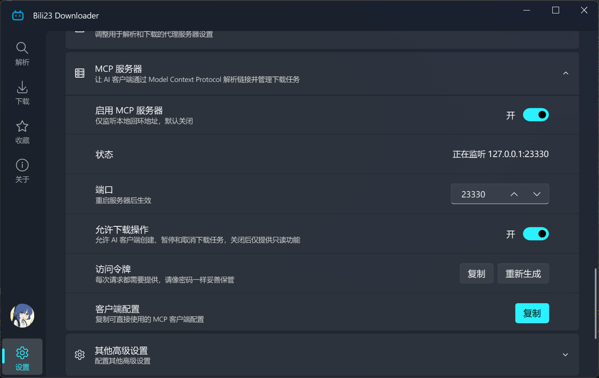
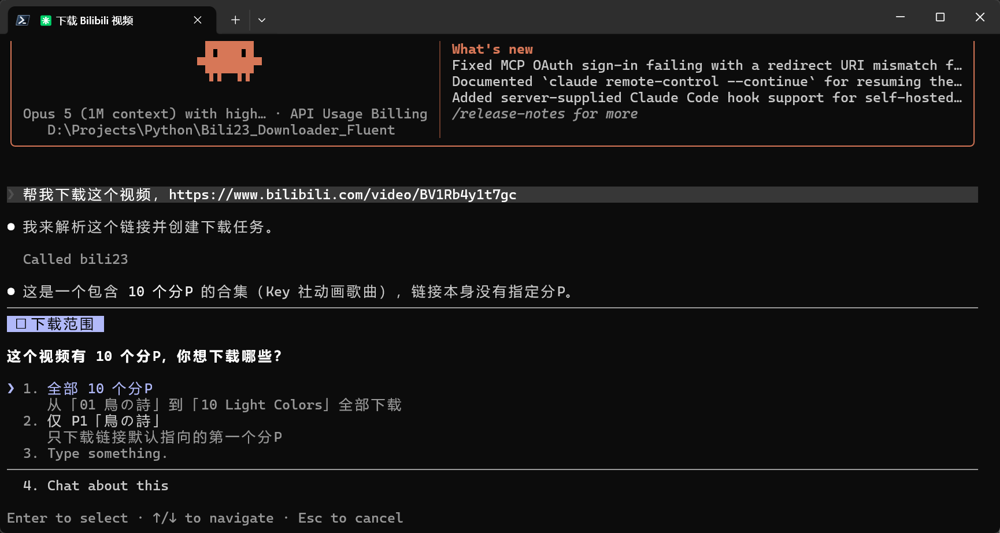
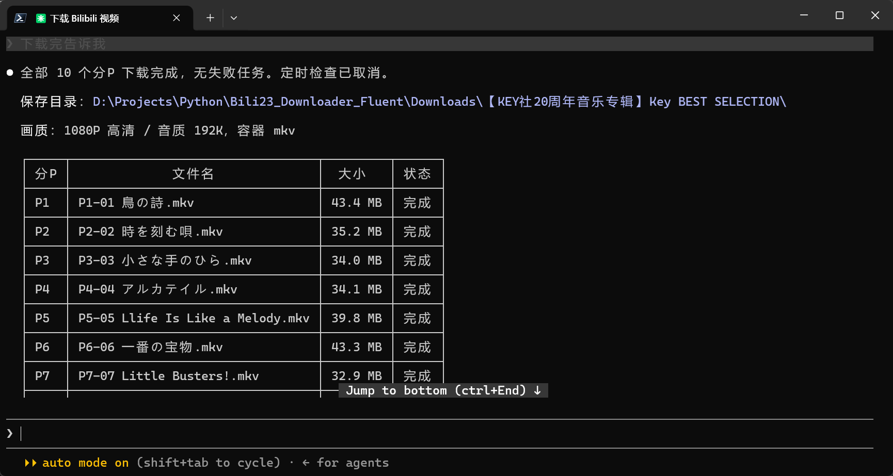

# MCP 服务器

::: warning 🚧 该功能尚未上线
MCP 服务器将在下一个版本（**2.15.0**）中提供，当前已发布的版本尚不支持。本页内容依据开发中的版本编写，实际行为请以发布后的版本为准。
:::

程序内置了一个 MCP（Model Context Protocol）服务器。开启后，支持该协议的 AI 客户端（如 Claude Code、Claude Desktop、Cherry Studio 等）就能直接操作下载器：解析链接、创建下载任务、查询进度、暂停或取消任务。

配置完成后，你可以直接对 AI 说「把这个链接里的视频都下载下来」，解析与建立任务的过程由它自行完成。

::: warning ⚠️ 该功能默认关闭
开启后程序会在本机监听一个端口。请先阅读 [安全说明](#安全说明)，确认你了解它的作用后再启用。
:::

## 开启方式

在 **[设置页] → [高级] → [MCP 服务器]** 中打开「启用 MCP 服务器」。



| 选项 | 说明 |
| :--- | :--- |
| 启用 MCP 服务器 | 总开关，默认关闭 |
| 状态 | 显示当前监听地址，或启动失败的原因 |
| 端口 | 默认 23330，可改为 1024 ~ 65535 之间的其他值 |
| 允许下载操作 | 关闭后只提供只读工具，AI 无法创建或控制下载任务 |
| 访问令牌 | 每个请求都必须携带，相当于密码，可随时重新生成 |
| 客户端配置 | 一键复制可直接使用的客户端配置 |

修改开关、端口或令牌后服务器会自动重启，无需重启程序。

## 配置 AI 客户端

点击「客户端配置」右侧的**复制**按钮，会得到一段这样的配置：

```json
{
  "mcpServers": {
    "bili23-downloader": {
      "type": "http",
      "url": "http://127.0.0.1:23330/mcp",
      "headers": {
        "Authorization": "Bearer 你的访问令牌"
      }
    }
  }
}
```

把它粘贴进 AI 客户端的 MCP 配置文件即可。各家客户端的配置文件位置不同，请参考对应客户端的说明。

使用 Claude Code 时，也可以直接用命令行添加：

```bash
claude mcp add --transport http --scope user bili23 http://127.0.0.1:23330/mcp --header "Authorization: Bearer 你的访问令牌"
```

::: tip 💡 关于 `--scope user`
不加这个参数时配置只写入当前项目的局部配置，部分运行环境不会加载它，表现为「连接显示正常，但一个工具都没有」。写入全局配置可以避免这个问题。
:::

配置完成后需要**重新启动 AI 客户端**（或新开一个会话），它才会读取到新增的服务器。

以下为 Claude Code 中的调用效果：




## 可用工具

以下工具在任何时候都可用：

| 工具 | 作用 |
| :--- | :--- |
| 解析链接 | 解析B站链接，结果会显示在程序的解析界面上 |
| 查看剧集 | 列出当前解析结果中的条目及其编号 |
| 任务列表 | 查看下载中或已完成的任务 |
| 任务状态 | 查看单个任务的进度、速度与输出文件路径 |
| 登录状态 | 查询当前登录的账号，用于判断能否获取会员内容 |

以下工具需要开启「允许下载操作」，关闭该开关后它们不会出现在工具列表中：

| 工具 | 作用 |
| :--- | :--- |
| 创建下载 | 按条目编号建立下载任务 |
| 暂停 / 继续 | 控制下载中的任务 |
| 取消 | 取消任务并从队列中移除，已下载的分片会被删除 |

::: tip 💡 提示
「允许下载操作」的变更会立即生效，但 AI 客户端通常会缓存工具列表，需要重新连接或新开会话才能看到变化。
:::

出于安全考虑，AI **不能**修改程序设置。画质、命名规则、下载目录等只能由你在界面上更改，AI 创建的任务会沿用你当前的全部设置，与你在界面上点击下载的结果完全一致。

## 使用限制

- **必须先解析再下载**：创建任务用的是解析列表中的条目编号，因此必须先解析链接。
- **解析会替换当前列表**：AI 发起解析时，解析界面上原有的内容会被替换。为避免打断你的操作，**当界面上有你手动勾选的条目时，AI 的解析请求会被拒绝**，需要你先完成或清空当前的选择。
- **部分条目需要单独解析**：收藏夹、个人空间等列表中的条目尚未获取到完整信息，不能直接建立任务，需要先对该条目单独解析一次。AI 收到相应提示后通常会自行处理。
- **单次数量上限**：一次最多返回 500 个条目（默认 100 个），一次最多创建 200 个下载任务。内容更多时可以分批进行。
- **程序需要能够响应**：工具调用需要程序主界面处理。若程序正弹出对话框等待你操作，调用会超时并提示 AI 稍后重试。

## 安全说明

- **只监听本机**：服务器绑定在环回地址 `127.0.0.1`，同一局域网内的其他设备无法访问。
- **必须携带令牌**：每个请求都要带上访问令牌，不正确的请求会被直接拒绝。
- **校验请求来源**：带有非本地来源的请求会被拒绝，防止网页利用 DNS rebinding 之类的手法驱动本机上的服务器。
- **令牌请勿外传**：它等同于操作你下载器的密码。若不慎泄露，点击「重新生成」即可作废旧令牌，之后需要用新令牌重新配置 AI 客户端。
- **可限制为只读**：关闭「允许下载操作」后，AI 只能查询状态与解析链接，无法创建或删除任何任务。

## 常见问题

::: details AI 客户端里找不到相关功能？
依次检查：程序是否正在运行、MCP 服务器开关是否已打开、配置中的令牌是否与程序内一致、添加配置后是否重新启动了 AI 客户端。使用 Claude Code 时还需确认是否加了 `--scope user`。
:::

::: details 提示服务器启动失败？
多为端口被其他程序占用，在设置中改用其他端口即可，具体原因会显示在「状态」一行。
:::

::: details 关闭程序后还能用吗？
不能。AI 客户端在启动时连接服务器，如果当时 Bili23 Downloader 没有运行，该次会话将无法使用这些功能，需要先打开程序再重新启动客户端。
:::

::: details 提示需要登录或画质不足？
MCP 使用的是你当前登录的账号。会员内容与最高画质需要相应的账号权限，可在程序内登录后重试，详见 [画质、音质与编码优先级](./media-priority.md)。
:::

::: details AI 说找不到某个任务？
暂停、继续、取消只能作用于下载队列中的任务，已经下载完成的任务不再受这些操作控制。
:::
