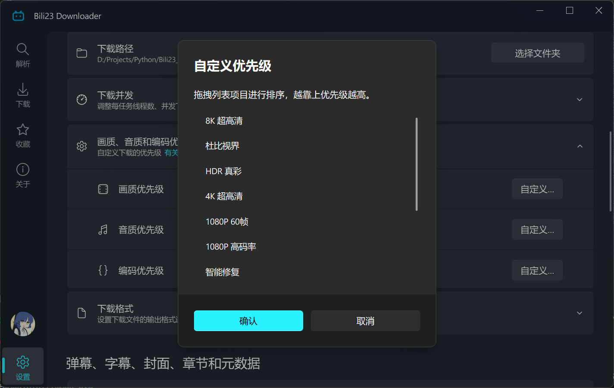

# 画质、音质与编码优先级

优先级决定程序**优先尝试哪一个选项**，而不是强制指定。视频本身没有的画质、账号权限不足的画质，都无法通过优先级获得。

## 优先级的工作方式

程序会按照你设定的顺序从上往下逐个尝试，取第一个实际可用的选项。

举例：若把画质优先级设为 `720P > 1080P > 4K`，程序会先尝试 720P；该视频没有 720P 时依次尝试 1080P、4K。

::: warning ⚠️ 优先级不能突破限制
最终能下载到什么，取决于三件事：视频本身提供了哪些选项、你的账号是否有权限、内容是否受 DRM 保护。优先级只在**多个可用选项之间**决定先后。
:::

## 设置入口

打开 **[设置页] → [下载]**，画质、音质、编码各有一个优先级列表，点击自定义按钮后**拖拽条目即可调整顺序，越靠上优先级越高**。

## 可选项一览

### 视频画质

| 画质 | 说明 |
| :--- | :--- |
| 8K 超高清 | 需要大会员，且视频本身支持 |
| 杜比视界 | 需要大会员，且视频本身支持 |
| HDR 真彩 | 需要大会员，且视频本身支持 |
| 4K SDR 增强 | 需要大会员，且视频本身支持 |
| 4K 超高清 | 需要大会员，且视频本身支持 |
| 1080P 60帧 | 需要大会员，且视频本身支持 |
| 1080P 高码率 | 需要大会员，且视频本身支持 |
| 智能修复 | 由B站对老旧视频进行的 AI 修复版本，需要大会员，且视频本身支持 |
| 1080P 高清 | 需要登录 |
| 720P 准高清 | 需要登录 |
| 480P 标清 | 未登录时的上限 |
| 360P 流畅 | — |

默认顺序为从高到低，即优先获取当前能拿到的最高画质。

### 音频音质

| 音质 | 说明 |
| :--- | :--- |
| Hi-Res 无损 | 需要大会员，且视频本身支持 |
| 杜比全景声 | 需要大会员，且视频本身支持 |
| 192 kbps | 常规视频的最高音质 |
| 132 kbps | — |
| 64 kbps | — |

### 视频编码

| 编码 | 特点 |
| :--- | :--- |
| AVC / H.264 | 文件体积最大，兼容性最好 |
| HEVC / H.265 | 文件体积较小，兼容性有限 |
| AV1 | 文件体积最小，兼容性最差 |

默认顺序为 `AVC > HEVC > AV1`，即优先选择兼容性最好的编码。

::: tip 💡 播放时黑屏或只有声音？
这类问题基本都是播放器缺少 HEVC / AV1 解码器所致。可以改用 [PotPlayer](https://potplayer.daum.net/) 或 [VLC](https://www.videolan.org/) 这类支持全格式解码的播放器；若必须用系统自带播放器，请把 AVC 拖到编码优先级的第一位后重新下载。
:::

## 权限与可用性

| 情况 | 可获取的画质 |
| :--- | :--- |
| 未登录 | 最高 480P |
| 已登录（普通账号） | 最高 1080P |
| 大会员 | 1080P 高码率、4K、HDR、杜比视界等 |
| 受 DRM 保护的内容 | 最高 1080P，更高画质无法获取 |

::: tip 💡 提示
付费课程绝大部分受完整 DRM 保护，无法下载；电影、纪录片一类的商业内容通常只能获取未加密的 1080P 版本。
:::

## 为单批任务临时调整

如果只是这一批内容需要不同的画质，不必修改全局设置。点击 **[下载所选项目]** 后，在下载选项对话框的「媒体设置」中可以直接指定本次使用的画质、音质与编码。

对话框中显示的媒体信息有几点需要注意：

- 信息默认取自解析结果中的**第一个视频**，批量下载时未必与你实际要下的那一个完全一致，仅供参考。
- 想查看某个具体条目的媒体信息，可在解析列表中右键该条目，选择「更新媒体信息」。
- 画质标注「试看」时，表示当前账号只能获取该视频的试看片段。
- 部分视频没有独立音轨（无声视频），或音轨已内嵌在视频流中，此时音质选项不可用，程序会给出说明。

::: tip 💡 提示
在这里的调整只对本批任务生效。若希望长期沿用，请回到 **[设置页] → [下载]** 修改优先级。
:::

## 相关设置

- **输出容器格式**（mp4 / mkv）：位于 **[设置页] → [下载]**。需要把弹幕、字幕嵌入视频时必须选择 mkv，详见 [弹幕、字幕与封面](./additional-content.md)。
- **合并视频和音频**：B站的视频与音频是分离的，需经 FFmpeg 合并才能得到完整文件。关闭合并会得到两个独立文件。
