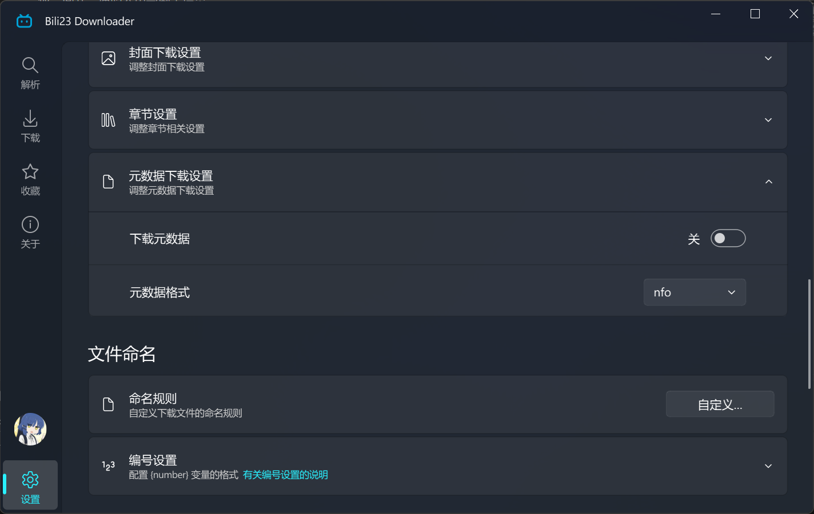

# 媒体库刮削

程序可以为下载的内容生成 NFO 元数据文件，配合合适的命名规则，就能被 Kodi、Emby、Jellyfin 等媒体库软件正确识别，直接呈现出海报、简介、演职人员与剧集信息。

## 开启方式

在 **[设置页] → [弹幕、字幕、封面、章节与元数据]** 中开启「下载元数据」，并把格式设为 **nfo**。



| 格式 | 用途 |
| :--- | :--- |
| nfo | 媒体库软件通用的元数据格式，用于刮削 |
| json | 导出解析到的原始信息，媒体库软件**不会**识别，适合自行处理数据 |

## 生成的文件

程序会根据内容类型生成不同结构的 NFO。

### 投稿视频

生成与视频同名的 `.nfo` 文件，按「电影」结构组织，包含：

| 字段 | 内容 |
| :--- | :--- |
| 标题 | 视频标题 |
| 简介 | 视频简介 |
| 时长 | 视频时长（分钟） |
| 首播日期 / 年份 | 视频发布时间 |
| 演职人员 | UP 主，角色标注为「UP主」，并附带其空间链接与头像 |
| 标签 | 视频的标签（会额外请求接口获取） |
| 封面 | 视频封面地址 |
| 唯一标识 | BV 号 |

### 番剧与课程

按「剧集」结构组织，会生成两类文件：

- **`tvshow.nfo`**：整季的信息，包含季标题、简介、首播日期、类型、地区、评分与完结状态、海报以及 season_id。该文件在同一目录下只生成一次，不会被后续单集重复覆盖。
- **每集的 `.nfo`**：单集信息，包含单集标题、剧情简介、时长、集号、首播日期、类型、地区、缩略图以及 ep_id。

同时，程序会把该季的竖版海报下载为同目录下的 `poster.jpg`，供媒体库直接使用。

## 配合命名规则

刮削器依赖**目录层级**来判断剧集结构，因此命名规则需要保证「一季一个文件夹」。推荐规则：

```
{season_title}/S{season_number:02d}E{episode_number:02d}
```

生成的目录结构如下：

```
轻音少女 第二季/
├── tvshow.nfo
├── poster.jpg
├── S02E01.mp4
├── S02E01.nfo
├── S02E02.mp4
└── S02E02.nfo
```

命名规则的写法详见 [自定义命名与归类](./naming-rule.md)。

::: warning ⚠️ 不要把不同季混在同一个文件夹
`tvshow.nfo` 描述的是**一整季**的信息，同一目录只会生成一份。若命名规则把多个季度输出到同一个文件夹，刮削结果会发生错乱。请确保规则中包含 `{season_title}` 或 `{series_title}` 这类能区分季度的变量。
:::

::: tip 💡 建议同时开启封面下载
NFO 中记录的是封面的网络地址，部分媒体库软件在离线或无法访问B站时无法加载。同时开启 [封面下载](./additional-content.md)，可以让本地始终有一份可用的图片。
:::

## 使用建议

- 投稿视频按「电影」结构刮削，适合放进媒体库的「电影」或自建媒体库；番剧与课程按「剧集」结构刮削，放进「剧集」类媒体库。
- 元数据在下载任务完成时生成。若下载完成后才开启该选项，已有的文件不会补生成，需要重新下载对应内容。
- 媒体库软件通常需要手动触发一次「扫描媒体库」才会读取新增的 NFO。
