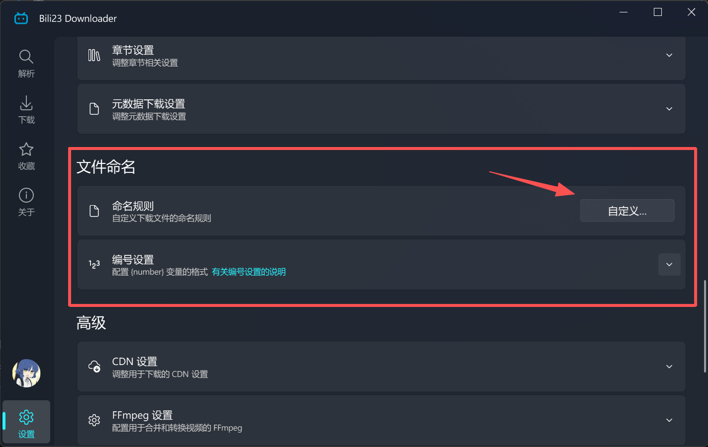
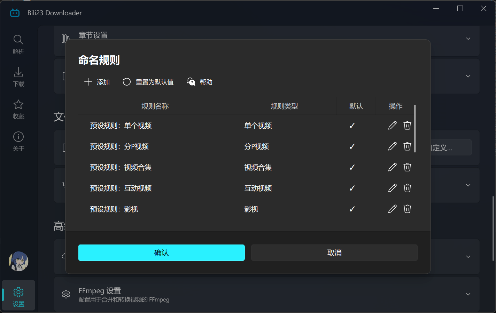
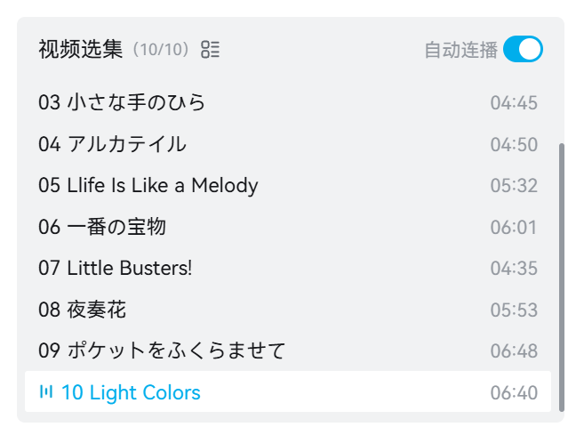
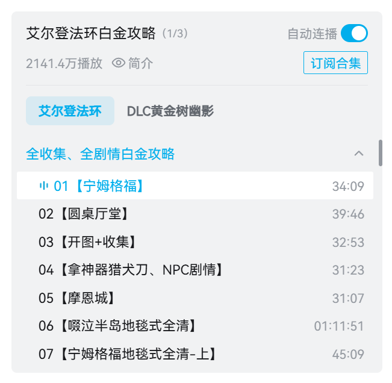
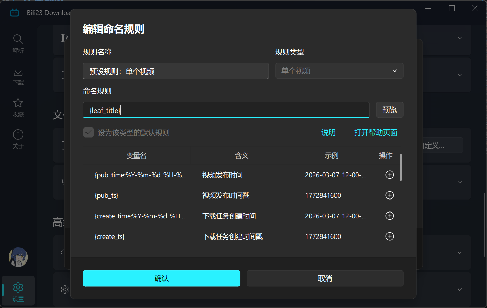

# 自定义命名与归类

命名规则决定了下载的文件叫什么名字、保存到哪个子目录。通过变量与 `/` 组合，可以让下载内容自动按 UP 主、合集、剧集或发布日期归类。

## 触发入口

打开 **[设置页] → [文件命名]**，点击命名规则一栏的编辑按钮，即可打开规则列表。

## 规则列表

规则列表按类型管理所有命名规则，每种类型都有一条被标记为「默认」的规则，下载时程序会按内容类型自动套用对应类型的默认规则。

- **添加**：新建一条规则，需要指定其适用的类型。
- **编辑 / 删除**：修改或移除规则，默认规则不能被删除。
- **重置**：把全部规则恢复为程序预设的初始状态。

程序预设的默认规则如下：

| 规则类型 | 预设规则 |
| :--- | :--- |
| 单个视频 | `{leaf_title}` |
| 分P视频 | `{parent_title}/P{p}-{leaf_title}` |
| 视频合集 | `{collection_title}/{section_title}/{parent_title}/{leaf_title}` |
| 互动视频 | `{parent_title}/{leaf_title}` |
| 影视 | `{season_title}/{episode_title}` |
| 课程 | `{series_title}/{episode_title}` |
| 收藏夹 | `{favorites_owner_id}_{favorites_owner}/{favorites_name}/{leaf_title}` |
| 个人空间 | `{space_owner_id}_{space_owner}/{leaf_title}` |
| 历史记录 | `{parent_title}/{leaf_title}` |
| 稍后再看 | `{parent_title}/{leaf_title}` |
| 每周必看 | `{parent_title}/{leaf_title}` |
| 音乐 | `{parent_title}/{uploader} - {leaf_title}` |

::: details 💡 如何区分分P与合集视频
##### 分P视频
选集列表中带有「视频选集」字样。

##### 合集视频
合集拥有独立的标题，且支持「订阅合集」功能。

:::

## 编辑规则

编辑规则对话框中可以设置规则名称、适用类型与规则本身，下方会列出该类型可用的全部变量。

- 双击变量右侧的按钮，或右键选择「插入变量」，可把变量直接插入到规则中。
- 点击 **[预览]**，可用示例数据查看规则最终生成的目录与文件名。
- 勾选「设为该类型的默认规则」后，该类型的下载都会套用这条规则。

## 基本语法

| 写法 | 含义 |
| :--- | :--- |
| `{变量名}` | 插入动态内容，如 `{leaf_title}` |
| `/` | 创建子目录，最后一个 `/` 之前为目录，之后为文件名 |
| 纯文本 | 原样保留，如 `【B站】{leaf_title}` |

扩展名（`.mp4`、`.m4a` 等）由程序自动补全，**不要写进规则里**。

## 可用变量

不同规则类型可用的变量并不相同，规则中若出现该类型不支持的变量，程序会将其忽略。以编辑规则对话框中列出的变量为准。

::: details 🖱️ 点击展开查看变量一览表

##### 通用变量

除「音乐」外的所有类型均可使用。

| 变量 | 说明 | 示例 |
| :--- | :--- | :--- |
| `{pub_time}` | 视频发布时间 | 2026-03-07_12-00-00 |
| `{pub_ts}` | 视频发布时间戳 | 1772841600 |
| `{create_time}` | 下载任务创建时间 | 2026-03-07_12-00-00 |
| `{create_ts}` | 下载任务创建时间戳 | 1772841600 |
| `{number}` | 序号 | 1 |
| `{uploader}` | UP 主昵称 | UP主昵称 |
| `{uploader_uid}` | UP 主 UID | 12345678 |
| `{video_quality}` | 画质 | 1080P |
| `{audio_quality}` | 音质 | 192K |
| `{video_codec}` | 编码 | HEVC |

##### 单个视频

| 变量 | 说明 | 示例 |
| :--- | :--- | :--- |
| `{leaf_title}` | 视频标题 | 游戏科学新作《黑神话：钟馗》先导预告 |
| `{aid}` | av 号 | 115056436060087 |
| `{bvid}` | BV 号 | BV1sHePzWEbG |
| `{cid}` | cid | 31809079869 |

##### 分P视频

| 变量 | 说明 | 示例 |
| :--- | :--- | :--- |
| `{parent_title}` | 视频标题 | 【KEY社20周年音乐专辑】Key BEST SELECTION |
| `{leaf_title}` | 分P标题 | 04 アルカテイル |
| `{p}` | 分P序号 | 4 |
| `{aid}` `{bvid}` `{cid}` | 同上 | — |

##### 视频合集

| 变量 | 说明 | 示例 |
| :--- | :--- | :--- |
| `{collection_title}` | 合集标题 | 艾尔登法环白金攻略 |
| `{section_title}` | 章节标题（未分章节则为空） | DLC黄金树幽影 |
| `{parent_title}` | 合集中单个视频的标题 | 全收集、全流程、全剧情攻略 |
| `{leaf_title}` | 分P标题 | 03【墓地平原-西+艾拉克河】 |
| `{p}` | 分P序号 | 3 |
| `{aid}` `{bvid}` `{cid}` | 同上 | — |

##### 互动视频

| 变量 | 说明 | 示例 |
| :--- | :--- | :--- |
| `{parent_title}` | 视频标题 | 【互动视频】你能逃出这个房间吗？ |
| `{leaf_title}` | 节点标题 | 序幕 |

##### 影视

| 变量 | 说明 | 示例 |
| :--- | :--- | :--- |
| `{series_title}` | 系列标题 | 轻音少女 |
| `{season_title}` | 季标题 | 轻音少女 第二季 |
| `{section_title}` | 章节标题 | 正片 |
| `{episode_title}` | 单集标题 | 第18话 主角！ |
| `{season_number}` | 季编号 | 2 |
| `{episode_number}` | 集编号 | 18 |
| `{ep_id}` | ep_id | 21296 |
| `{season_id}` | season_id | 1173 |
| `{aid}` `{bvid}` `{cid}` | 同上 | — |

##### 课程

| 变量 | 说明 | 示例 |
| :--- | :--- | :--- |
| `{series_title}` | 课程标题 | 【618限时价】清华梁爽：0-N1日语精讲高级班 |
| `{section_title}` | 章节标题 | 先导片 |
| `{episode_title}` | 单集标题 | 【先导片】清华梁爽带你重新定义日语学习 |
| `{ep_id}` | ep_id | 158662 |
| `{season_id}` | season_id | 4016 |
| `{aid}` `{cid}` | 同上 | — |

##### 收藏夹

除通用变量与「单个视频」的变量外，还可使用：

| 变量 | 说明 | 示例 |
| :--- | :--- | :--- |
| `{favorites_name}` | 收藏夹名称 | 默认收藏夹 |
| `{favorites_id}` | 收藏夹 ID | 12345678 |
| `{favorites_owner}` | 收藏夹创建者昵称 | 用户昵称 |
| `{favorites_owner_id}` | 收藏夹创建者 UID | 12345678 |
| `{fav_time}` | 收藏时间 | 2026-03-07_12-00-00 |
| `{fav_ts}` | 收藏时间戳 | 1772841600 |
| `{parent_title}` | 视频标题 | 【KEY社20周年音乐专辑】Key BEST SELECTION |

##### 个人空间

除通用变量与「单个视频」的变量外，还可使用：

| 变量 | 说明 | 示例 |
| :--- | :--- | :--- |
| `{space_owner}` | 空间主人昵称 | 用户昵称 |
| `{space_owner_id}` | 空间主人 UID | 12345678 |

##### 历史记录

| 变量 | 说明 | 示例 |
| :--- | :--- | :--- |
| `{parent_title}` | 固定为「历史记录」 | 历史记录 |
| `{leaf_title}` | 视频标题 | 游戏科学新作《黑神话：钟馗》先导预告 |
| `{last_watched_time}` | 最后观看时间 | 2026-03-07_12-00-00 |
| `{last_watched_ts}` | 最后观看时间戳 | 1772841600 |

##### 稍后再看

| 变量 | 说明 | 示例 |
| :--- | :--- | :--- |
| `{parent_title}` | 固定为「稍后再看」 | 稍后再看 |
| `{leaf_title}` | 视频标题 | 游戏科学新作《黑神话：钟馗》先导预告 |
| `{fav_time}` | 添加时间 | 2026-03-07_12-00-00 |
| `{fav_ts}` | 添加时间戳 | 1772841600 |

##### 每周必看

| 变量 | 说明 | 示例 |
| :--- | :--- | :--- |
| `{parent_title}` | 期数 | 第377期(0612更新) |
| `{leaf_title}` | 视频标题 | 游戏科学新作《黑神话：钟馗》先导预告 |

##### 音乐

音乐类型不使用通用变量，可用变量如下：

| 变量 | 说明 | 示例 |
| :--- | :--- | :--- |
| `{leaf_title}` | 歌曲名称 | 歌曲名称 |
| `{uploader}` | 歌手 | 歌手 |
| `{parent_title}` | 歌单名称 | 歌单名称 |
| `{audio_quality}` | 音质 | 192K |
| `{pub_time}` `{pub_ts}` | 发布时间 / 时间戳 | — |
| `{create_time}` `{create_ts}` | 任务创建时间 / 时间戳 | — |
| `{number}` | 序号 | 1 |
:::

## 变量格式化

### 时间变量

`{pub_time}`、`{create_time}`、`{fav_time}`、`{last_watched_time}` 支持 Python 的 `strftime` 格式，写法为 `{变量名:格式}`。

| 写法 | 结果 |
| :--- | :--- |
| `{pub_time:%Y-%m-%d}` | 2026-03-07 |
| `{pub_time:%Y年%m月%d日}` | 2026年03月07日 |
| `{pub_time:%Y-%m}` | 2026-03 |
| `{pub_time:%Y-%m-%d_%H-%M-%S}` | 2026-03-07_12-00-00 |

### 数字变量

`{number}`、`{season_number}`、`{episode_number}`、`{p}` 支持数字格式化，最常用的是前置补零，可避免文件管理器中出现 `1, 10, 2` 这样的错乱排序。

| 写法 | 结果 |
| :--- | :--- |
| `{number:02d}` | 01 |
| `{episode_number:03d}` | 018 |
| `{p:04d}` | 0004 |

### 序号变量

`{number}` 的取值方式可在 **[设置页] → [文件命名] → [编号]** 中调整：

| 编号模式 | 说明 |
| :--- | :--- |
| 每批任务从 1 开始连续编号 | 每次新建下载任务时重新从 1 开始 |
| 使用解析列表中的序号 | 直接采用条目在解析列表中的位置，不受下载顺序影响 |
| 全局连续编号 | 跨批次持续累加，起始值可自定义 |

::: tip 💡 提示
预设规则中并不包含 `{number}`，需要编号时请先把它写进规则。
:::

## 命名示例

| 规则 | 生成结果 | 场景 |
| :--- | :--- | :--- |
| `{uploader}_{leaf_title}` | `UP主昵称_视频标题.mp4` | 扁平化命名，避免重名 |
| `{uploader}/{leaf_title}` | `UP主昵称/视频标题.mp4` | 按 UP 主建立文件夹 |
| `{bvid}/P{p:02d}_{leaf_title}` | `BV1xxxxxxx/P01_分P标题.mp4` | 以 BV 号建档，分P补零排序 |
| `{pub_time:%Y-%m}/{leaf_title}` | `2026-03/视频标题.mp4` | 按发布月份归档 |
| `{season_title}/S{season_number:02d}E{episode_number:02d}` | `轻音少女 第二季/S02E18.mp4` | 适配 Kodi、Emby 等刮削器 |

## 规则限制

::: warning ⚠️ 编写规则时的限制
1. 规则不能为空，且不能以 `/` 或 `.` 开头或结尾。
2. 除作为目录分隔符的 `/` 外，规则中不能出现 `< > : \ " | ? *` 以及控制字符。
3. 变量取值中若含有上述非法字符（如标题中的 `:`），程序会自动替换为 `_`，不会导致下载失败。
:::

::: tip 💡 提示
下载目录在创建任务时就已确定，之后修改命名规则不会影响已经存在的任务。
:::
