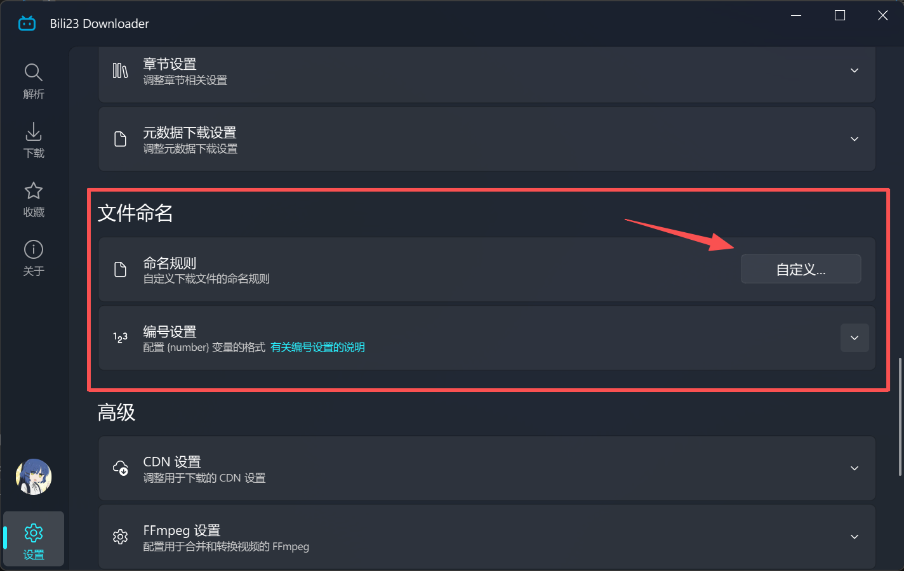
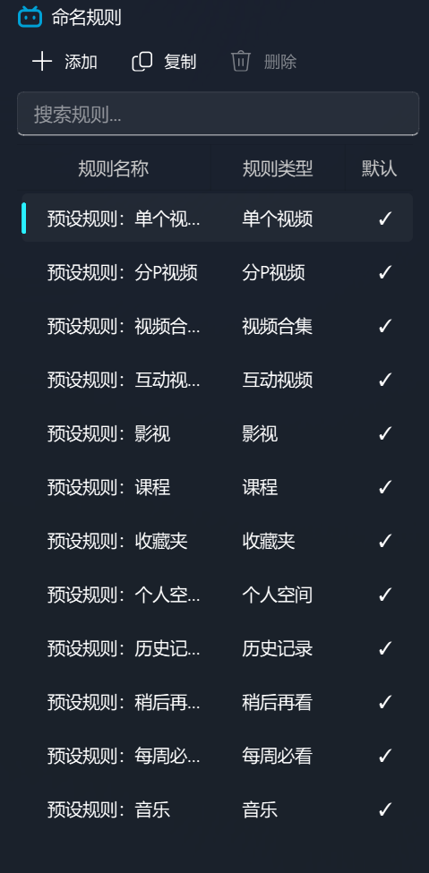
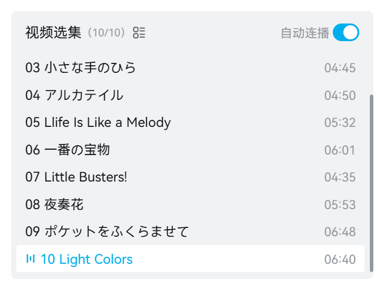
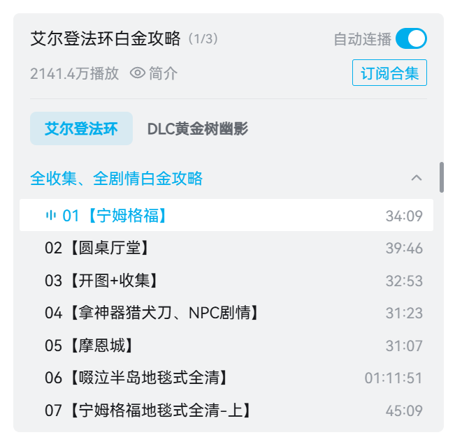
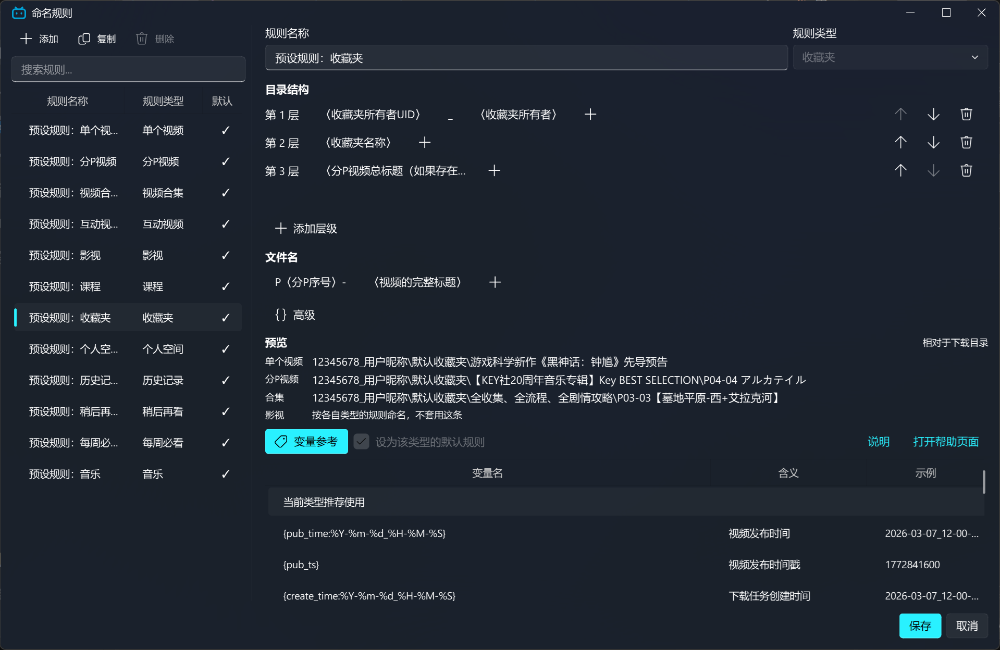

# 自定义命名与归类

命名规则决定了下载的文件叫什么名字、保存到哪个子目录。通过变量与目录层级的组合，可以让下载内容自动按 UP 主、合集、剧集或发布日期归类。

规则支持两种编写方式：默认展示的**可视化编辑器**（点选变量、组装层级），以及可以直接编写规则字符串的**高级模式**。两者实时同步，可以随时切换。

## 触发入口

打开 **[设置页] → [文件命名]**，点击命名规则一栏的 **[自定义…]**，即可打开「命名规则」窗口。

## 规则列表

「命名规则」窗口左侧是规则列表，右侧是编辑区。程序按内容类型分别管理命名规则，每种类型都有一条被标记为「默认」的规则，下载时程序会按内容类型自动套用对应类型的默认规则。

- **添加 / 复制 / 删除**：只作用于当前选中的规则，默认规则不能被删除。
- **搜索框**：按规则名称、类型、规则内容筛选列表。
- **拖拽调整顺序**：调整后的顺序会影响下载选项对话框中规则下拉列表的呈现顺序。
- **右键菜单**：
  - **恢复内置默认**：只把选中的这一条内置规则恢复为出厂值，不影响其他规则；自建规则没有出厂值可恢复，此项会置灰。
  - **重置为默认值**：整表重置，所有自定义规则与改动过的内置规则都会被丢弃，恢复为程序预设的初始状态。

程序预设的默认规则如下：

| 规则类型 | 预设规则 |
| :--- | :--- |
| 单个视频 | `{leaf_title}` |
| 分P视频 | `{parent_title}/P{p}-{leaf_title}` |
| 视频合集 | `{collection_title}/{section_title}/{parent_title}/{leaf_title}` |
| 互动视频 | `{parent_title}/{leaf_title}` |
| 影视 | `{season_title}/{episode_title}` |
| 课程 | `{series_title}/{episode_title}` |
| 收藏夹 | `{favorites_owner_id}_{favorites_owner}/{favorites_name}/{parent_title}/<P{p:02d}->{leaf_title}` |
| 个人空间 | `{space_owner_id}_{space_owner}/{parent_title}/<P{p:02d}->{leaf_title}` |
| 历史记录 | `{source_title}/{parent_title}/<P{p:02d}->{leaf_title}` |
| 稍后再看 | `{source_title}/{parent_title}/<P{p:02d}->{leaf_title}` |
| 每周必看 | `{source_title}/{leaf_title}` |
| 音乐 | `{source_title}/{uploader} - {leaf_title}` |

::: tip 💡 什么是 `<P{p:02d}->` 这样的写法
`< >` 包裹的是**可选段**：段内任一变量取空值时，整段（连同里面的文字）都会被丢弃。以 `<P{p:02d}->{leaf_title}` 为例：
- 分P视频的第 4P：渲染成 `P04-第四P标题`
- 单个视频（没有分P序号）：渲染成 `第四P标题`，不会留下 `P00-` 这样没有意义的前缀

这正是同一条规则能同时兼顾单个视频与分P视频的原因。详见下方 [可选段语法](#高级模式)。
:::

收藏夹、个人空间、历史记录、稍后再看这几类，列表里本身就混着单个视频、分P视频与合集三种「形态」，因此它们的默认规则统一用可选段来兼容三种形态，不必分别建三条规则。

### 来源列表里混入的其他类型

收藏夹、历史记录、稍后再看、个人空间这几类来源列表，可能混有影视或课程条目。这些条目**不会**套用来源类型的命名规则，而是按它们各自类型（影视 / 课程）的规则命名：

| 来源类型 | 混入的其他类型 |
| :--- | :--- |
| 收藏夹 | 影视 |
| 历史记录 | 影视、课程 |
| 稍后再看 | 影视 |
| 个人空间 | 课程 |

编辑收藏夹、历史记录等规则时，预览区会额外提示一行，说明这部分条目不受当前规则影响，避免误以为整份列表都按这一条命名。

::: details 💡 如何区分分P、合集视频
##### 分P视频
选集列表中带有「视频选集」字样。

##### 合集视频
合集拥有独立的标题，且支持「订阅合集」功能。

:::

## 可视化编辑器

编辑区把一条规则拆成若干**目录层级**加一个固定在最后的**文件名**行，每一行由若干**片段**组成，片段要么是一个变量，要么是一段纯文字。

- **添加片段（＋）**：点击每一行末尾的 **+** 按钮，菜单会直接列出该类型推荐的变量、「更多变量」子菜单，以及「插入文字」。
- **编辑片段**：点击某个片段（芯片）会弹出编辑面板，可以修改它的变量、格式、前缀与后缀；纯文字片段则直接编辑文字内容。右键片段也能打开同样的菜单。
- **前缀 / 后缀会随变量一起消失**：这就是可选段在可视化视图里的样子。例如前缀填 `P`、变量选 `{p}` 并设置补零格式、后缀填 `-`，分P视频会渲染成 `P01-`，单个视频（`{p}` 取不到值）时这一整段都会消失，不留下孤零零的 `P00-`。
- **目录层级**：点击 **[添加层级]** 新增一层，每层可以上移、下移、删除，最多 8 层；内容为空的目录层会在渲染时被自动省略，不需要手动标记「可选」。
- **文件名行**固定在最后一行，不能删除也不能移动位置。

::: tip 💡 部分规则无法用可视化编辑器表达
手写的复杂规则（例如嵌套可选段）可能无法还原成可视化视图，此时编辑区会禁用并提示原因，请改到下方的「高级」区域中直接编辑规则字符串。可视化编辑器的每一次修改也会实时同步写回高级区。
:::

## 高级模式

点击 **[高级]** 展开原始的规则字符串输入框，可以直接查看或编写完整的规则。

| 写法 | 含义 |
| :--- | :--- |
| `{变量名}` | 插入动态内容，如 `{leaf_title}` |
| `{变量名:格式}` | 按指定格式渲染变量，如 `{p:02d}` |
| `/` | 创建子目录，最后一个 `/` 之前为目录，之后为文件名 |
| `<...>` | 可选段：段内任一变量取空值时，整段（含里面的文字）一并丢弃 |
| 纯文本 | 原样保留，如 `【B站】{leaf_title}` |

扩展名（`.mp4`、`.m4a` 等）由程序自动补全，**不要写进规则里**。

`<` `>` 是可选段专用的定界符，不提供转义写法——这两个字符本来就不允许出现在 Windows 文件名里，字面量中出现它们会被判定为非法字符。

## 实时预览

预览区会把同一条规则**并排**套用到「单个视频」「分P视频」「合集」三种样本数据上，分别显示各自的渲染结果（相对下载目录的相对路径），可以直观看出哪些片段会在哪种情况下收缩。

收藏夹、历史记录、稍后再看、个人空间这几类，预览区还会多显示一行，提示混入的影视 / 课程条目按各自类型的规则命名，见上文 [来源列表里混入的其他类型](#来源列表里混入的其他类型)。

## 编辑规则

- **规则名称 / 规则类型**：已经是默认规则时，类型不能修改，也不能取消「默认」勾选——取消后该类型就没有可用规则了。
- **设为该类型的默认规则**：勾选后，该类型的下载都会套用这条规则。
- **变量参考**：默认展开的变量表，按「当前类型推荐使用」与「其余可用变量」分组；双击或右键某一行可以复制对应的变量写法（`{变量名}`），但插入规则仍然要通过上方可视化编辑器每一行的 **+** 按钮。
- **说明 / 打开帮助页面**：「说明」在应用内弹出一段简要指南；「打开帮助页面」会跳转到本页面。

## 可用变量

不同规则类型可用的变量并不相同，规则中若出现该类型不支持的变量，保存时会被拦下并提示「未知变量」。以编辑区变量参考表中列出的为准。

::: details 🖱️ 点击展开查看变量一览表

##### 通用变量

除「音乐」外的所有类型均可使用。

| 变量 | 说明 | 示例 |
| :--- | :--- | :--- |
| `{pub_time}` | 视频发布时间 | 2026-03-07_12-00-00 |
| `{pub_ts}` | 视频发布时间戳 | 1772841600 |
| `{create_time}` | 下载任务创建时间 | 2026-03-07_12-00-00 |
| `{create_ts}` | 下载任务创建时间戳 | 1772841600 |
| `{number}` | 序号 | 1 |
| `{uploader}` | UP 主昵称 | UP主昵称 |
| `{uploader_uid}` | UP 主 UID | 12345678 |
| `{video_quality}` | 画质 | 1080P |
| `{audio_quality}` | 音质 | 192K |
| `{video_codec}` | 编码 | HEVC |

##### 单个视频

| 变量 | 说明 | 示例 |
| :--- | :--- | :--- |
| `{leaf_title}` | 视频的完整标题 | 游戏科学新作《黑神话：钟馗》先导预告 |
| `{aid}` | av 号 | 115056436060087 |
| `{bvid}` | BV 号 | BV1sHePzWEbG |
| `{cid}` | cid | 31809079869 |

##### 分P视频

| 变量 | 说明 | 示例 |
| :--- | :--- | :--- |
| `{parent_title}` | 该分P视频总标题 | 【KEY社20周年音乐专辑】Key BEST SELECTION |
| `{p}` | 分P序号 | 4 |
| `{leaf_title}` | 当前分P的小节标题 | 04 アルカテイル |
| `{aid}` `{bvid}` `{cid}` | 同上 | — |

##### 视频合集

| 变量 | 说明 | 示例 |
| :--- | :--- | :--- |
| `{collection_title}` | 合集名称 | 艾尔登法环白金攻略 |
| `{section_title}` | 章节名称（若未分章节则为空） | DLC黄金树幽影 |
| `{parent_title}` | 若视频为多P，则为此视频的总标题；否则为空 | 全收集、全流程、全剧情攻略 |
| `{leaf_title}` | 视频内容标题（普通视频为视频标题，分P视频为当前小节标题） | 03【墓地平原-西+艾拉克河】 |
| `{p}` | 分P序号（仅当视频为多P时有效） | 3 |
| `{aid}` `{bvid}` `{cid}` | 同上 | — |

##### 互动视频

| 变量 | 说明 | 示例 |
| :--- | :--- | :--- |
| `{leaf_title}` | 节点标题 | 序幕 |
| `{parent_title}` | 互动视频标题 | 【互动视频】你能逃出这个房间吗？ |

##### 影视

| 变量 | 说明 | 示例 |
| :--- | :--- | :--- |
| `{series_title}` | 本系列标题 | 轻音少女 |
| `{season_title}` | 本季标题 | 轻音少女 第二季 |
| `{section_title}` | 章节名称 | 正片 |
| `{episode_title}` | 本集标题 | 第18话 主角！ |
| `{season_number}` | 本季编号 | 2 |
| `{episode_number}` | 本集编号 | 18 |
| `{ep_id}` | ep_id | 21296 |
| `{season_id}` | season_id | 1173 |
| `{aid}` `{bvid}` `{cid}` | 同上 | — |

##### 课程

| 变量 | 说明 | 示例 |
| :--- | :--- | :--- |
| `{series_title}` | 课程标题 | 【618限时价】清华梁爽：0-N1日语精讲高级班 |
| `{section_title}` | 章节名称 | 先导片 |
| `{episode_title}` | 本集标题 | 【先导片】清华梁爽带你重新定义日语学习 |
| `{ep_id}` | ep_id | 158662 |
| `{season_id}` | season_id | 4016 |
| `{aid}` `{cid}` | 同上 | — |
| `{course_id}` `{lesson_id}` `{item_id}` `{section_id}` | 会员购课程 / 课时 / 商品 / 课时 ID，仅会员购商城课程有值 | — |

##### 收藏夹

除通用变量与「单个视频」的变量外，还可使用：

| 变量 | 说明 | 示例 |
| :--- | :--- | :--- |
| `{parent_title}` | 分P视频总标题（如果存在） | 【KEY社20周年音乐专辑】Key BEST SELECTION |
| `{favorites_name}` | 收藏夹名称 | 默认收藏夹 |
| `{favorites_id}` | 收藏夹 ID | 12345678 |
| `{favorites_owner}` | 收藏夹所有者昵称 | 用户昵称 |
| `{favorites_owner_id}` | 收藏夹所有者 UID | 12345678 |
| `{fav_time}` | 收藏时间 | 2026-03-07_12-00-00 |
| `{fav_ts}` | 收藏时间戳 | 1772841600 |

##### 个人空间

除通用变量与「单个视频」的变量外，还可使用：

| 变量 | 说明 | 示例 |
| :--- | :--- | :--- |
| `{parent_title}` | 分P视频总标题（如果存在） | 【KEY社20周年音乐专辑】Key BEST SELECTION |
| `{space_owner}` | 空间主人昵称 | 用户昵称 |
| `{space_owner_id}` | 空间主人 UID | 12345678 |

##### 历史记录

| 变量 | 说明 | 示例 |
| :--- | :--- | :--- |
| `{source_title}` | 固定为「历史记录」 | 历史记录 |
| `{parent_title}` | 该稿件的标题（仅分P与合集条目有值） | 【KEY社20周年音乐专辑】Key BEST SELECTION |
| `{leaf_title}` | 视频的完整标题 | 游戏科学新作《黑神话：钟馗》先导预告 |
| `{last_watched_time}` | 上次观看时间 | 2026-03-07_12-00-00 |
| `{last_watched_ts}` | 上次观看时间戳 | 1772841600 |

##### 稍后再看

| 变量 | 说明 | 示例 |
| :--- | :--- | :--- |
| `{source_title}` | 固定为「稍后再看」 | 稍后再看 |
| `{parent_title}` | 该稿件的标题（仅分P与合集条目有值） | 【KEY社20周年音乐专辑】Key BEST SELECTION |
| `{leaf_title}` | 视频的完整标题 | 游戏科学新作《黑神话：钟馗》先导预告 |
| `{fav_time}` | 添加时间 | 2026-03-07_12-00-00 |
| `{fav_ts}` | 添加时间戳 | 1772841600 |

##### 每周必看

每周必看的条目从不二次解析，没有分P、合集之分。

| 变量 | 说明 | 示例 |
| :--- | :--- | :--- |
| `{source_title}` | 期数 | 第377期(0612更新) |
| `{leaf_title}` | 视频的完整标题 | 游戏科学新作《黑神话：钟馗》先导预告 |

##### 音乐

音乐类型不使用通用变量，可用变量如下：

| 变量 | 说明 | 示例 |
| :--- | :--- | :--- |
| `{leaf_title}` | 歌曲名称 | 歌曲名称 |
| `{uploader}` | 歌曲作者 | 歌手 |
| `{source_title}` | 歌单名称 | 歌单名称 |
| `{audio_quality}` | 音质 | 192K |
| `{pub_time}` `{pub_ts}` | 发布时间 / 时间戳 | — |
| `{create_time}` `{create_ts}` | 任务创建时间 / 时间戳 | — |
| `{number}` | 序号 | 1 |
:::

## 变量格式化

### 时间变量

点击时间类变量的片段，「格式」下拉框会给出几种常用的 `strftime` 预设，选中后旁边会标注渲染示例：

| 预设 | 示例 |
| :--- | :--- |
| `%Y-%m-%d` | 2026-03-07 |
| `%Y-%m` | 2026-03 |
| `%Y` | 2026 |
| `%Y-%m-%d_%H-%M-%S` | 2026-03-07_12-00-00 |
| `%Y年%m月%d日` | 2026年03月07日 |

下拉框最后一项是「自定义…」，可以填写预设之外的任意 `strftime` 格式串。高级模式下则直接写作 `{变量名:格式}`，如 `{pub_time:%Y-%m-%d}`。

### 数字变量

数字类变量（`{number}`、`{season_number}`、`{episode_number}`、`{p}`）的格式下拉框提供几种补零预设，可避免文件管理器中出现 `1, 10, 2` 这样的错乱排序：

| 预设 | 示例 |
| :--- | :--- |
| 原样 | 1 |
| `02d` | 01 |
| `03d` | 018 |
| `04d` | 0004 |

同样可以选择「自定义…」填写其他格式。高级模式下写作 `{episode_number:03d}` 这样的形式。

### 序号变量

`{number}` 的取值方式可在 **[设置页] → [文件命名] → [编号设置]** 中调整：

| 编号模式 | 说明 |
| :--- | :--- |
| 每批次从1开始顺序编号 | 每次新建下载任务时重新从 1 开始 |
| 使用解析列表中的序号 | 直接采用条目在解析列表中的位置，不受下载顺序影响 |
| 全局顺序编号 | 跨批次持续累加，起始值可自定义 |

::: tip 💡 提示
预设规则中并不包含 `{number}`，需要编号时请先在可视化编辑器中把它添加进规则。
:::

## 命名示例

| 规则 | 生成结果 | 场景 |
| :--- | :--- | :--- |
| `{uploader}_{leaf_title}` | `UP主昵称_视频标题.mp4` | 扁平化命名，避免重名 |
| `{uploader}/{leaf_title}` | `UP主昵称/视频标题.mp4` | 按 UP 主建立文件夹 |
| `{parent_title}/<P{p:02d}->{leaf_title}` | 分P：`视频总标题/P01_分P标题.mp4`；单P：`视频总标题/视频标题.mp4` | 一条规则同时兼顾单P与分P |
| `{pub_time:%Y-%m}/{leaf_title}` | `2026-03/视频标题.mp4` | 按发布月份归档 |
| `{season_title}/S{season_number:02d}E{episode_number:02d}` | `轻音少女 第二季/S02E18.mp4` | 适配 Kodi、Emby 等刮削器 |

## 规则限制

::: warning ⚠️ 编写规则时的限制
1. 规则不能为空，且不能以 `/` 或 `.` 开头或结尾。
2. 除作为目录分隔符的 `/`、可选段定界符 `< >` 外，规则中不能出现 `: \ " | ? *` 以及控制字符。
3. 可选段中必须至少包含一个变量，否则保存时会被拦下——一个不含变量的段永远不会被丢弃，写了也没有意义。
4. 变量取值中若含有上述非法字符（如标题中的 `:`），程序会自动替换为 `_`，不会导致下载失败。
:::

::: tip 💡 提示
下载目录在创建任务时就已确定，之后修改命名规则不会影响已经存在的任务。
:::
