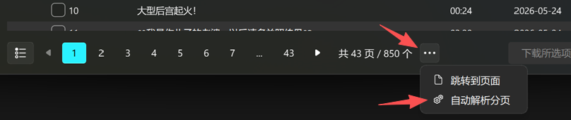
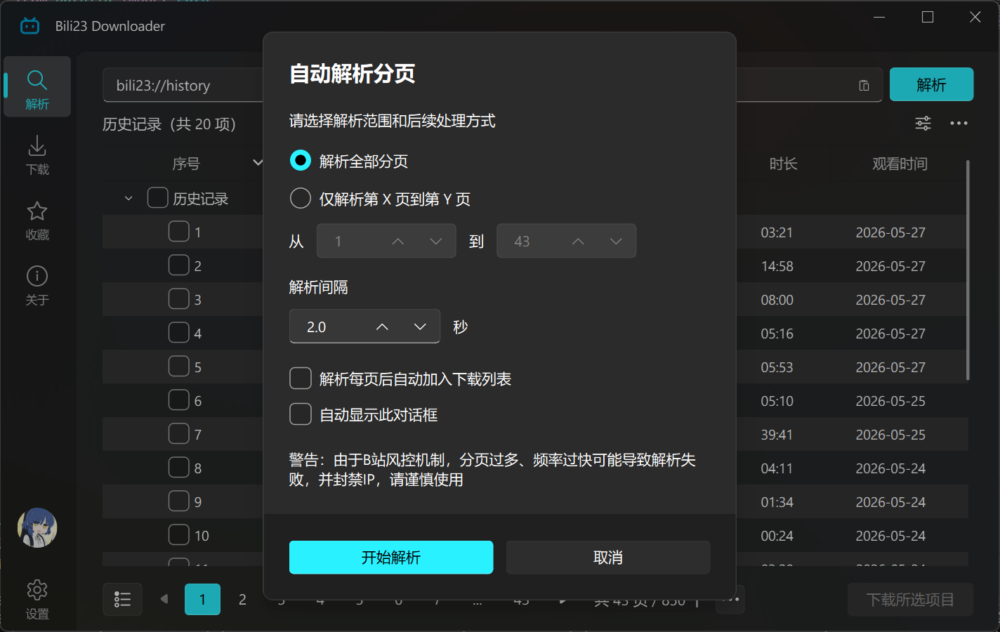

# 自动解析分页

当你解析收藏夹、个人空间、历史记录、稍后再看等分页类型链接时，可以启用自动解析分页功能。它支持一键解析全部分页，也支持只解析指定的页码范围，适合批量下载场景。

## 触发入口

该功能入口如图所示，位于底部分页组件右侧，点击"···"按钮将弹出菜单，选择"自动解析分页"即可进入。

## 功能说明

结合图中的选项，你可以按需控制以下行为：

- **解析范围**：选择解析全部分页，或仅解析第 X 页到第 Y 页。
- **解析间隔**：自定义每次分页解析之间的等待时间，降低触发风控的概率。
- **解析后处理**：可选择在每页解析完成后自动加入下载列表。
- **弹窗行为**：可设置是否每次都自动显示该对话框，方便重复使用。

::: warning ⚠️ 注意
由于B站风控机制，分页过多、频率过快可能导致解析失败，并封禁IP，请谨慎使用！
:::
