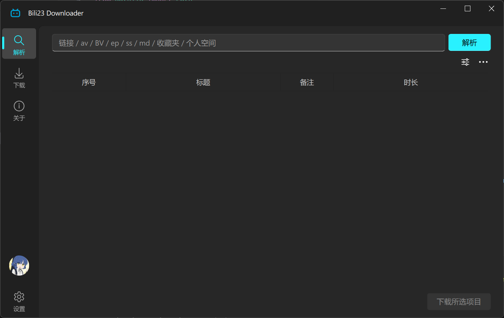
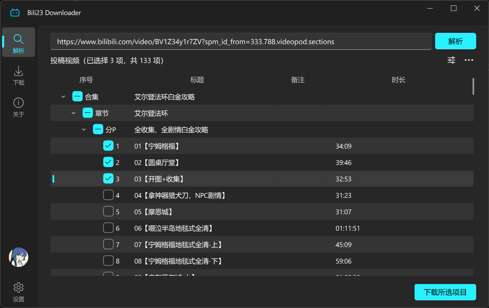
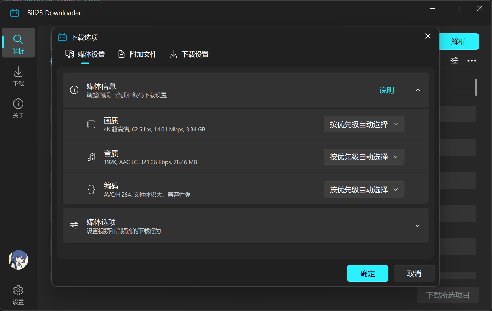
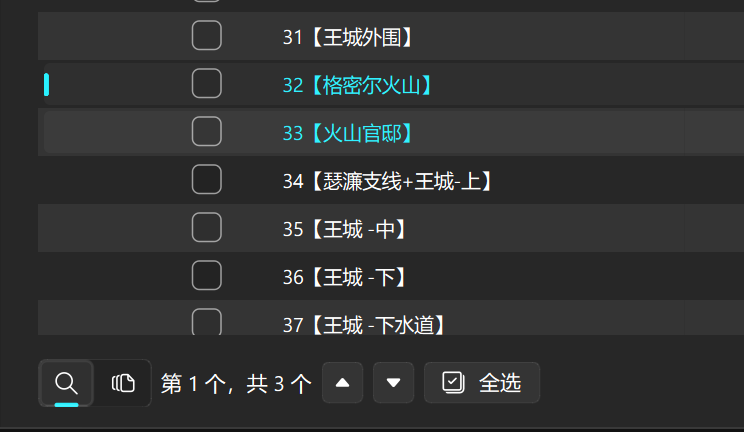
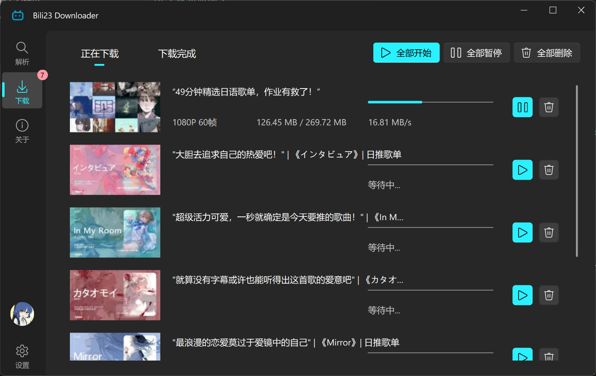
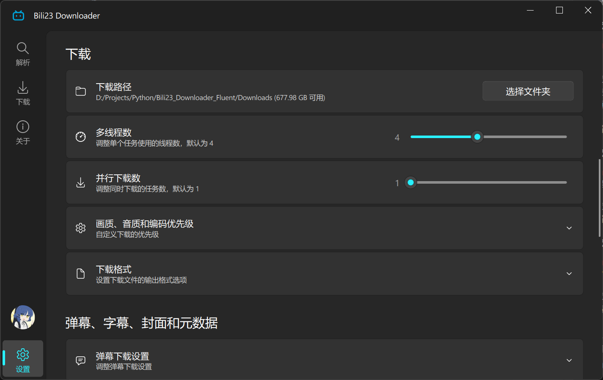

# 基础使用

## 1. 主界面概览

程序启动后分为三大核心功能区，你可以通过侧边栏/顶部的标签导航进行切换：
- **解析页**：粘贴视频链接并获取可下载的栏目列表，是程序的默认首页。
- **下载页**：集中追踪下载进度，管理正在下载和已完成的任务。
- **设置页**：自定义保存路径、画质优先级及其他软件运行行为。

::: tip 💡 获取高画质的必做前提
强烈建议在使用前**登录你的哔哩哔哩账号**。未登录状态下，B站接口最高仅允许获取 **480P** 画质的视频。
:::

---

## 2. 核心下载流程

### 第一步：输入链接解析

在首页的链接输入框内粘贴你想要下载的 B 站链接，点击 **[解析]** 按钮即可获取视频列表。

::: info 📌 支持解析的链接类型
- **常规投稿**：单个视频、分P视频、合集视频
- **影视综类**：剧集（番剧、电影、纪录片、国创、电视剧、综艺）
- **精选栏目**：每周必看
- **聚合目录**：公开收藏夹、UP 主个人空间网页
- **其他格式**：付费课程（仅限未 DRM 加密部分）、`b23.tv` 等防红短链接
:::

### 第二步：选择与确认下载

勾选列表中你需要下载的视频复选框，点击右下角的 **[下载所选项目]**。

此时程序会弹出**下载选项对话框**，你可以预览媒体预估大小等信息，并能根据需要临时微调该批任务的参数（如强选 H.264 编码格式）。确认无误后点击 **[确认]** 即可将其加入下载队列。

::: details 🖱️ 进阶技巧：如何搜索与批量快速选择？
如果是面对包含成百上千个视频的大型收藏夹，可以使用以下高级功能辅助选择：

- **搜索定位**：点击解析按钮下方的“更多选项”图标，打开搜索对话框。输入关键词后会在解析列表中高亮显示相关项。
  
- **系统快捷键**：在列表范围内按下 <kbd>Ctrl</kbd> + <kbd>A</kbd> 迅速全选，<kbd>Ctrl</kbd> + <kbd>D</kbd> 取消除全选。
- **划定范围选择**：在“更多选项”中打开批量选择对话框，输入行号范围（如 `1-5,7,9-12`），点击确认可极速圈选对应序列的视频。
:::

---

## 3. 管理下载任务

切换至 **[下载页]**，你可以在此实时追踪当前的网速与单个任务的下载进度。

::: tip 💡 快捷操作菜单
在此页面内，**右键点击**任意下载任务可呼出功能菜单，能随时进行 **暂停、恢复、彻底删除** 或 **重新下载** 等操作。
:::

---

## 4. 个性化设置

切换至 **[设置页]**，这里提供了丰富的配置项，可一劳永逸地满足你的个人使用习惯：
- **基础设定**：修改默认文件保存路径、文件命名规则、多文件并发下载数量。
- **媒体规则**：配置首选的最高画质、优先采用的视频编码（AVC / HEVC / AV1）。
- **附加元数据**：设定软件是否自动附带下载并转换 **XML/ASS弹幕**、**外挂字幕**、**保存封面图** 以及生成用于家庭影院系统（Kodi/Emby等）刮削的 **NFO媒体信息文件**。