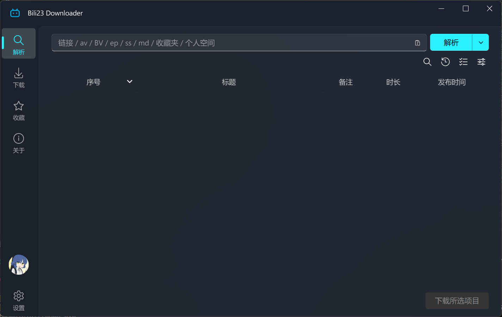
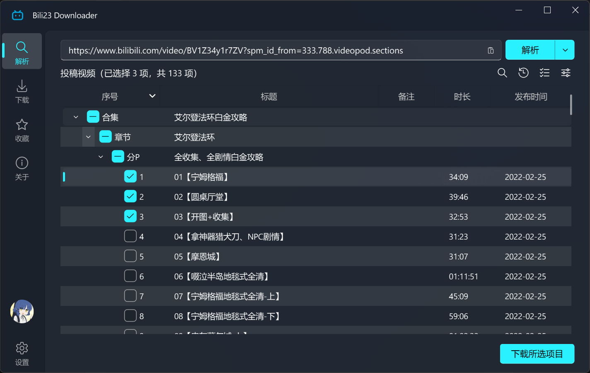
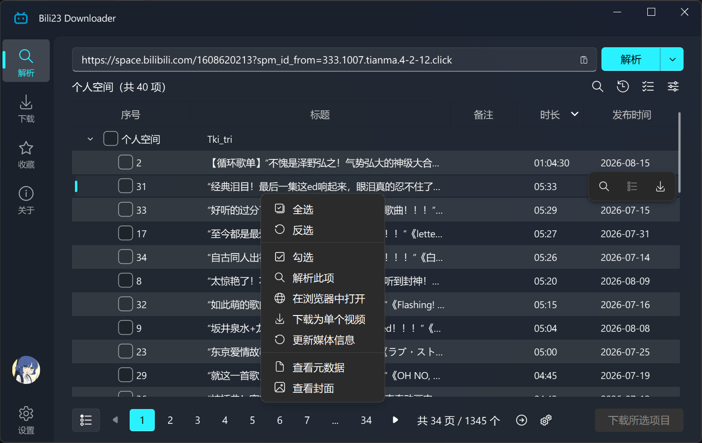
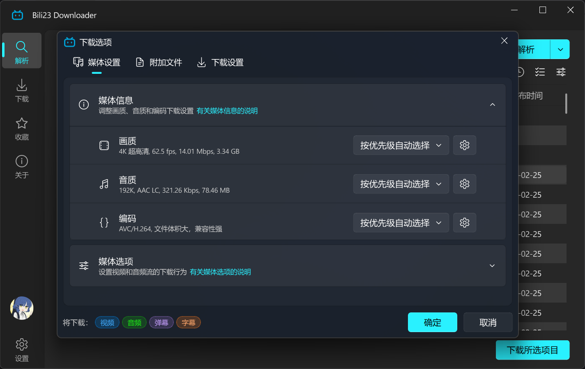
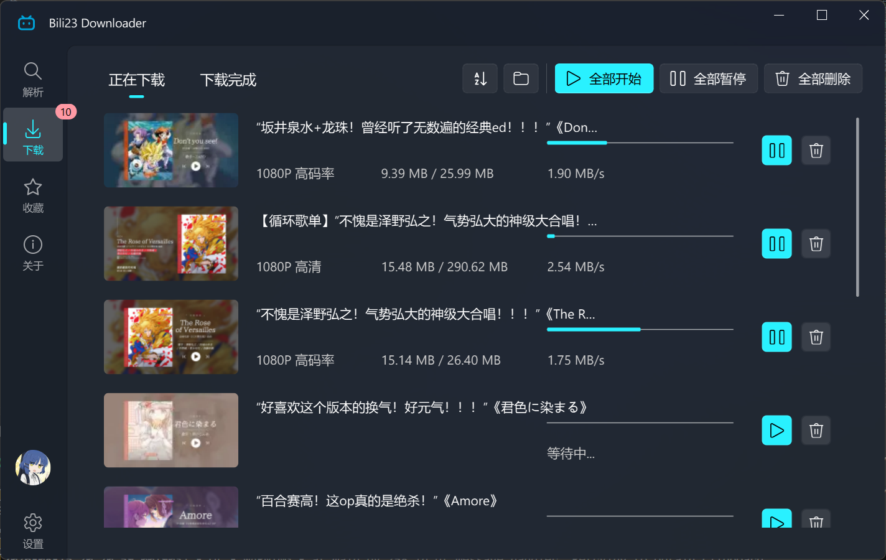
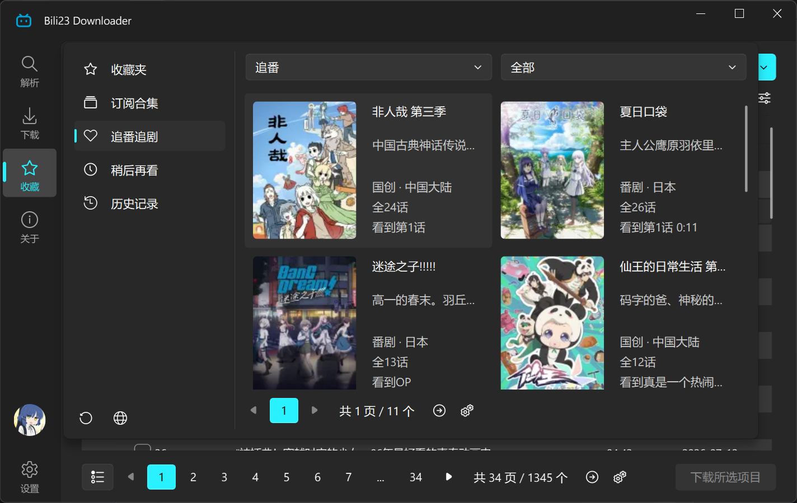
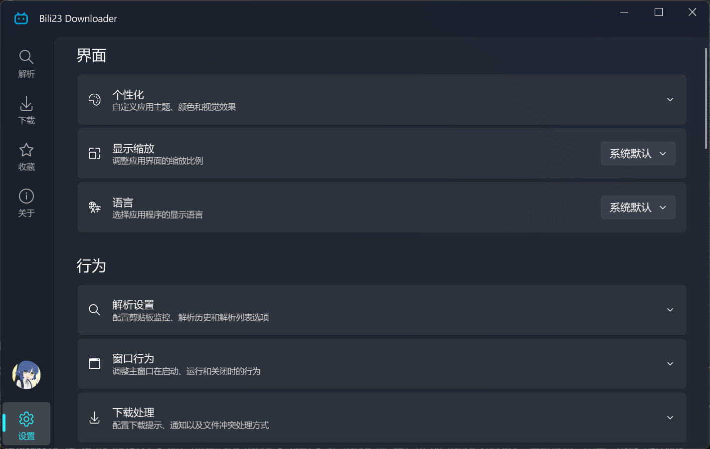

# 基础使用

本页介绍从登录、解析到下载的完整流程。进阶功能（命名规则、自动解析分页、关键词搜索等）请参阅「进阶使用」分类下的对应页面。

## 主界面

程序采用侧边导航，各入口的作用如下：

| 入口 | 说明 |
| :--- | :--- |
| 解析 | 粘贴链接获取可下载的内容列表，程序的默认首页 |
| 下载 | 管理正在下载与已完成的任务 |
| 收藏 | 快速访问账号内的收藏夹、追番、稍后再看、历史记录等 |
| 关于 | 查看版本信息与项目主页 |
| 头像（左下角） | 登录账号 / 查看当前账号信息 |
| 设置（左下角） | 修改保存路径、画质优先级及其他运行行为 |

## 登录账号

点击左下角头像即可登录，支持三种方式：

- **扫码登录**：使用哔哩哔哩手机客户端扫描二维码。
- **短信登录**：输入手机号获取验证码后登录。
- **Cookie 登录**：粘贴浏览器导出的 Cookie，支持 JSON 与分号分隔两种格式。

<!-- 图片占位：登录对话框 -->

::: tip 💡 获取高画质的必做前提
未登录状态下，B站接口最高仅返回 **480P** 画质。1080P 及以上需要登录，4K、HDR、杜比等画质还需要对应的大会员权限。
:::

## 解析内容

在链接输入框中粘贴链接，点击 **[解析]**（或直接回车）即可获取内容列表。

::: info 📌 支持解析的链接类型
- **常规投稿**：单个视频、分P视频、合集视频、互动视频
- **影视综类**：番剧、电影、纪录片、国创、电视剧、综艺
- **精选栏目**：每周必看
- **聚合目录**：公开收藏夹、UP 主个人空间、订阅合集、稍后再看、历史记录
- **其他格式**：付费课程（仅限未 DRM 加密部分）、音乐、`b23.tv` 短链接
- **纯编号**：直接输入 av 号、BV 号、ep/ss/md 号也可解析
:::

::: tip 💡 批量解析
点击 **[解析]** 按钮右侧的下拉箭头，选择「批量解析」，可一次粘贴多条链接（每行一条）逐个解析，并可选择每解析完一条就自动加入下载列表。该功能目前仅支持 av 号与 BV 号链接。
:::

### 列表操作

解析结果以树形列表呈现，勾选需要下载的条目即可。工具栏与快捷操作如下：

| 操作 | 说明 |
| :--- | :--- |
| 搜索 | 按关键词定位条目，详见 [按关键词搜索](/doc/keyword-search) |
| 解析历史 | 查看并重新解析近期解析过的链接 |
| 批量选择 | 输入行号范围（如 `1-5,7,9-12`）快速勾选 |
| 下载选项 | 打开下载选项对话框调整本次下载的参数 |
| <kbd>Ctrl</kbd> + <kbd>A</kbd> / <kbd>Ctrl</kbd> + <kbd>D</kbd> | 全选 / 取消全选 |
| 点击表头 | 按该列排序，再次点击切换升序与降序 |

在条目上点击右键，还可以进行以下操作：

- **解析此项**：把该条目作为新链接重新解析。
- **在浏览器中打开**：跳转到对应的B站页面。
- **作为单个视频下载**：忽略命名规则中的目录结构，直接下载为单个文件。
- **查看元数据 / 查看封面**：查看该条目的详细信息与封面图。

### 分页内容

解析收藏夹、个人空间、合集等内容时，底部会出现分页组件，可翻页、跳页，也可以一次性解析全部分页，详见 [自动解析分页](/doc/auto-parse-page)。

## 下载选项

勾选完成后点击右下角 **[下载所选项目]**，程序会弹出下载选项对话框，可在此调整本批任务的参数。

对话框分为三个部分：

| 分页 | 可调整的内容 |
| :--- | :--- |
| 媒体设置 | 画质、音质、编码；是否下载视频流 / 音频流、是否合并、是否保留原始文件 |
| 附加内容 | 弹幕、字幕、封面、章节、元数据的下载与嵌入方式 |
| 下载设置 | 本次使用的命名规则，以及是否每次下载前都显示该对话框 |

对话框底部的标签会实时显示本次将要下载的内容（视频、音频、弹幕、字幕、封面、章节、元数据），确认无误后点击 **[确定]** 即可加入下载队列。

::: tip 💡 提示
这里的调整仅对本批任务生效。若希望长期生效，请到 **[设置页]** 中修改对应的默认值。
:::

## 管理下载任务

下载页分为「正在下载」与「已完成」两个列表。

- **批量操作**：正在下载列表可全部开始、全部暂停、全部删除；已完成列表可一键清空记录。
- **排序**：可按创建时间、标题、文件大小、下载进度排序（已完成列表为完成时间、标题、文件大小）。
- **打开目录**：直接打开当前的下载目录。
- **右键菜单**：暂停 / 继续、重新下载、删除；已完成的任务还可以重新解析其来源链接。

::: tip 💡 断点续传
下载任务会保存在本地数据库中，关闭程序不会丢失。未完成的任务在下次启动后可继续下载，无需从头开始。
:::

## 收藏内容

点击导航栏的「收藏」会弹出面板，在已登录的情况下可直接读取账号内的内容：

| 分类 | 说明 |
| :--- | :--- |
| 收藏夹 | 自己创建与收藏的收藏夹 |
| 订阅合集 | 已订阅的视频合集 |
| 追番追剧 | 追番与追剧列表，可按想看 / 在看 / 看过筛选 |
| 稍后再看 | 稍后再看列表 |
| 历史记录 | 近期观看记录 |

::: tip 🚀 联动解析
点击任意条目，程序会自动提取其链接并跳转到解析页开始解析，无需回到浏览器复制链接。
:::

## 个性化设置

设置页按用途分为以下几组：

| 分组 | 主要内容 |
| :--- | :--- |
| 界面 | 主题、云母效果、显示缩放、界面语言 |
| 行为 | 解析列表的显示方式、自动勾选规则、剪贴板监听、窗口与关闭行为、重复下载与文件重名的处理方式 |
| 下载 | 下载目录、并行任务数与分片线程数、限速、输出容器格式，以及 [画质 / 音质 / 编码优先级](/doc/media-priority) |
| 弹幕、字幕、封面、章节与元数据 | 各类附加内容是否下载、输出格式与嵌入方式，详见 [弹幕、字幕与封面](/doc/additional-content) 与 [媒体库刮削](/doc/metadata-scraping) |
| 文件命名 | 命名规则与编号方式，详见 [自定义命名与归类](/doc/naming-rule) |
| 高级 | CDN 服务器、FFmpeg 来源、代理设置、日志查看 |
| 更新 | 检查程序更新 |

::: tip 💡 提示
语言、显示缩放、FFmpeg 来源与代理模式等选项需要重启程序后才会生效，程序会在修改后给出提示。
:::
