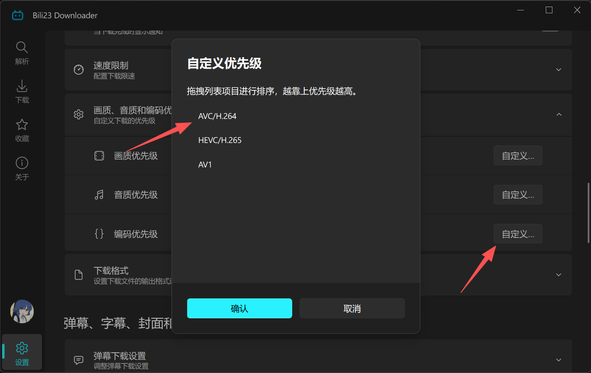
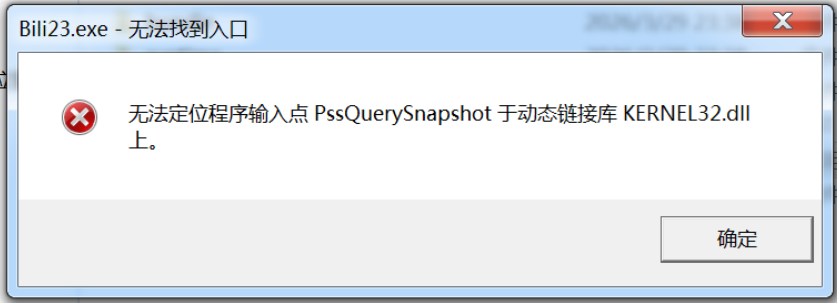
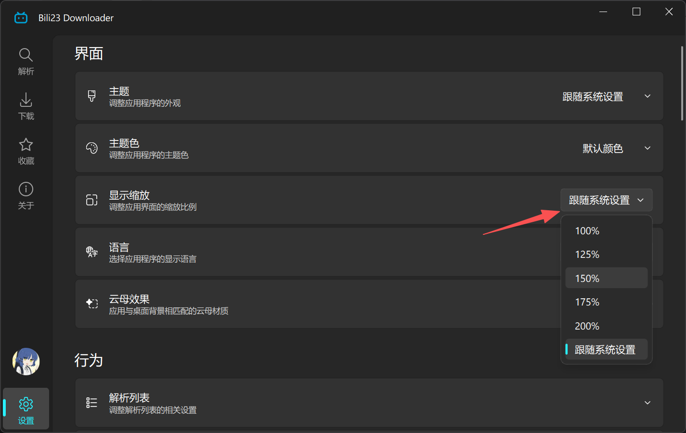
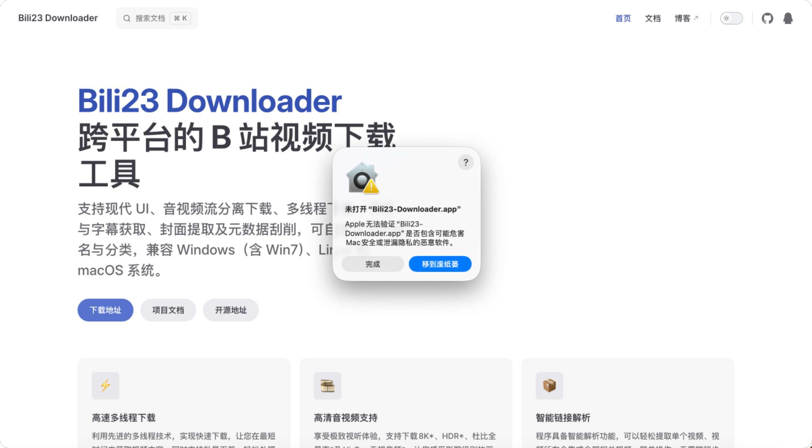
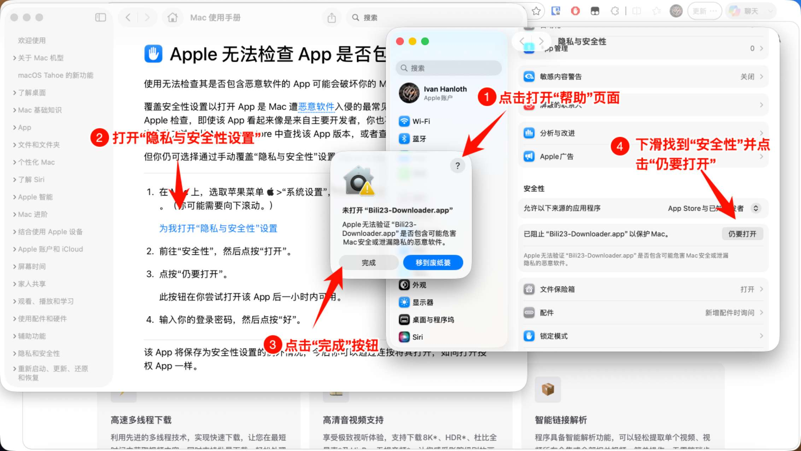
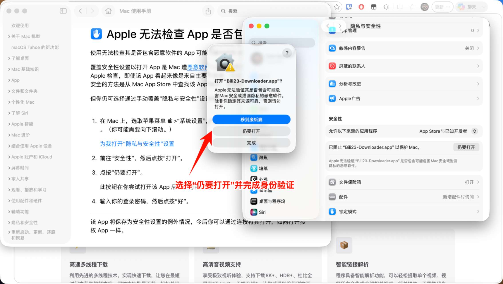

# 常见问题

## 下载问题

::: details 为什么我只能下载 480P 画质的视频？
未登录状态下，B站接口限制最高只能获取 480P 画质。  
**解决方法**：请在软件内**登录你的哔哩哔哩账号**后再进行解析和下载。
:::

::: details 为什么不能下载大会员专享、充电专属或付费视频？
本软件**不支持且绝不会**绕过任何付费墙或会员限制，所能获取的内容权限完全取决于你当前登录账号的状态。  
**解决方法**：请确保你的账号已开通“大会员”或已经购买了对应的内容。
:::

::: details 为什么不能下载已购买课程，或电影/纪录片没有 4K 画质？
即使你已经购买或拥有大会员，部分受严格版权保护的商业内容（如课程、电影、纪录片）会受到 **DRM（数字版权管理）加固保护**。
- **电影/纪录片**：受 DRM 保护的内容通常最高只能下载未加密的 **1080P** 画质版本。
- **付费课程**：绝大部分均受完整 DRM 保护，因此**完全无法下载**。
:::

::: details 为什么会提示解析失败（412 Precondition Failed）？
这是由于你在短时间内频繁发起解析或下载请求，触发了 B 站的风控拦截机制。
**解决方法**：
- **等待解除**：暂停使用软件，等待一段时间（通常几个小时至半天）风控会自动解除。
- **更换网络**：如果急需下载，可以尝试重启路由器以更换 IP，或者连接手机热点网络再试。
:::

::: details 为什么下载的视频无法播放，或者只有声音没有画面？
这通常是因为视频采用了较高压缩率的 **AV1** 或 **HEVC (H.265)** 编码格式，而你电脑系统自带的基础播放器缺少相应的解码器导致无法显示画面。

**解决方法**（任选其一均可）：
- **方法一（推荐）**：使用支持全格式解码的专业播放器，例如 [PotPlayer](https://potplayer.daum.net/) 或 [VLC](https://www.videolan.org/)。
- **方法二**：在程序设置中，将兼容性最广的 **AVC (H.264)** 拖拽到列表顶部，然后重新下载该视频。

:::

## Windows 7 用户常见问题

::: details 我是 Windows 7 用户，为什么无法运行程序？

请到 [下载发行版](/doc/releases.html) 页面，下载专门提供的 Windows 7 版本安装包进行安装。
:::

::: details 为什么界面看起来太小了，字体模糊不清？

因为 Windows 7 的 DPI 缩放机制与现代 Windows 10/11 不兼容，导致程序无法正确识别当前的显示缩放比例，从而界面元素过小且字体模糊。  
**解决方法**：请在程序设置中调整显示缩放比例。
:::

## macOS 用户常见问题

::: details 我是 macOS 用户，为什么提示 Apple 无法检查其是否包含恶意软件？

这是由于软件没有进行 Apple 开发者的高级公证（Notarization），首次运行时会被系统的基础安全策略拦截。

**解决方法**：  

:::
