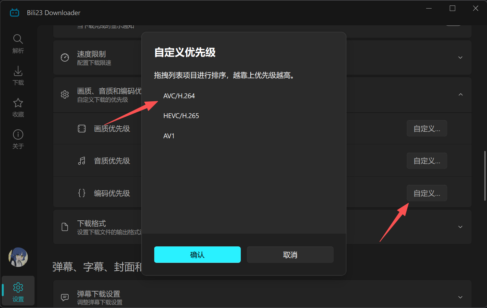
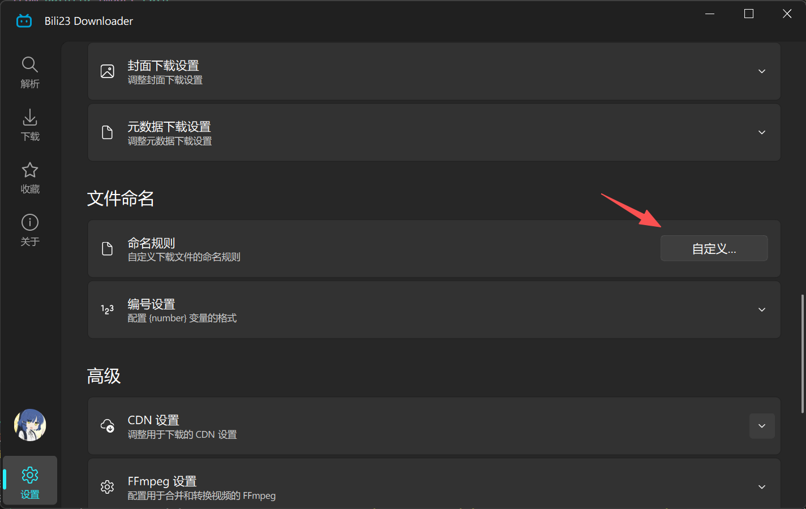
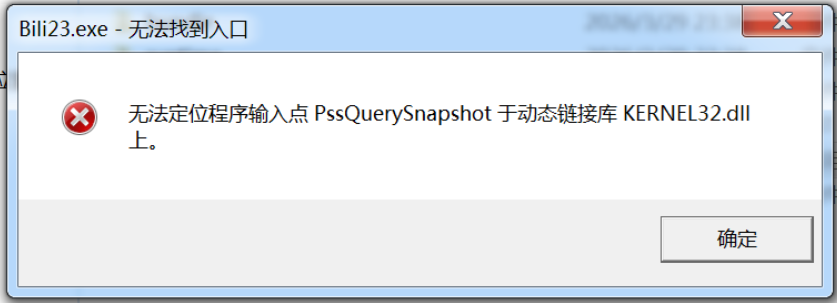
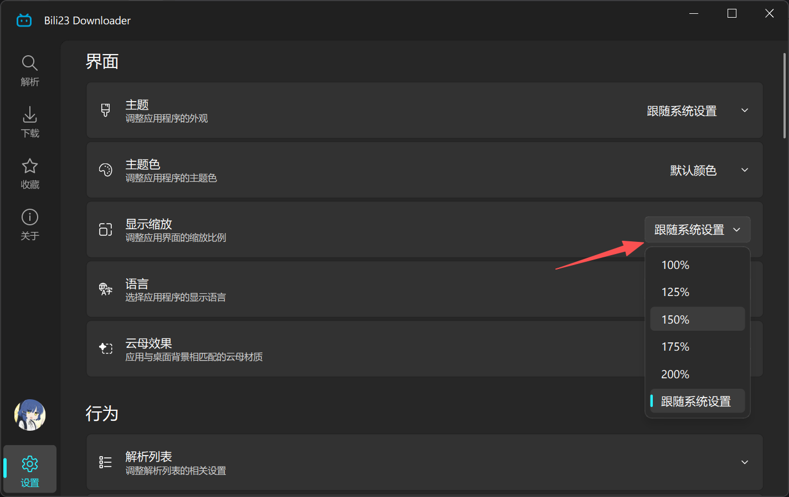
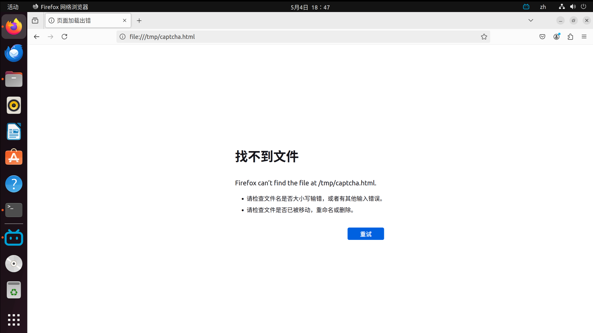
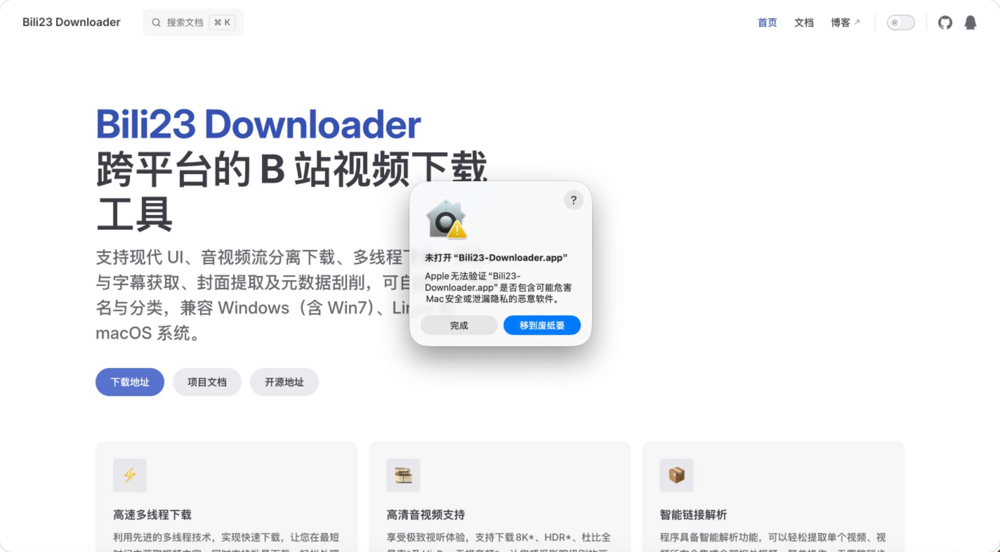
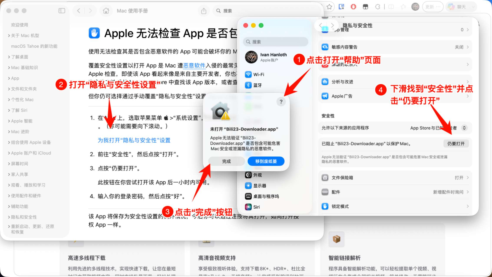
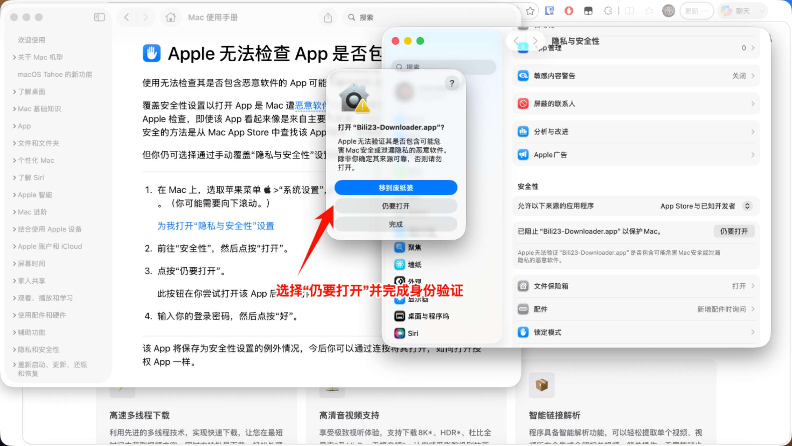

# 常见问题

## 下载问题

::: details 能下载抖音、快手、小红书等其他平台的视频吗？
不支持。本软件专为下载哔哩哔哩平台视频而设计，无法解析或下载其他平台的视频内容。
:::

::: details 为什么我只能下载 480P 画质的视频？
未登录状态下，B站接口限制最高只能获取 480P 画质。  
**解决方法**：请在软件内**登录你的哔哩哔哩账号**后再进行解析和下载。
:::

::: details 为什么不能下载大会员专享、充电专属或付费视频？
本软件**不支持且绝不会**绕过任何付费墙或会员限制，所能获取的内容权限完全取决于你当前登录账号的状态。  
**解决方法**：请确保你的账号已开通“大会员”或已经购买了对应的内容。
:::

::: details 为什么不能下载已购买课程，或电影/纪录片没有 4K 画质？
即使你已经购买或拥有大会员，部分受严格版权保护的商业内容（如课程、电影、纪录片）会受到 **DRM（数字版权管理）加固保护**。
- **电影/纪录片**：受 DRM 保护的内容通常最高只能下载未加密的 **1080P** 画质版本。
- **付费课程**：绝大部分均受完整 DRM 保护，因此**完全无法下载**。
:::

::: details 为什么会提示解析失败（412 Precondition Failed）？
这是由于你在短时间内频繁发起解析或下载请求，触发了 B 站的风控拦截机制。
**解决方法**：
- **等待解除**：暂停使用软件，等待一段时间（通常几个小时至半天）风控会自动解除。
- **更换网络**：如果急需下载，可以尝试重启路由器以更换 IP，或者连接手机热点网络再试。
:::

::: details 为什么下载的视频无法播放，或者只有声音没有画面？
这通常是因为视频采用了较高压缩率的 **AV1** 或 **HEVC (H.265)** 编码格式，而你电脑系统自带的基础播放器缺少相应的解码器导致无法显示画面。

**解决方法**（任选其一均可）：
- **方法一（推荐）**：使用支持全格式解码的专业播放器，例如 [PotPlayer](https://potplayer.daum.net/) 或 [VLC](https://www.videolan.org/)。
- **方法二**：在程序设置中，将兼容性最广的 **AVC (H.264)** 拖拽到列表顶部，然后重新下载该视频。

:::

::: details 为什么下载的视频外面还有一层文件夹？为什么下载的视频顺序是乱的？
这是因为程序使用了预设的命名规则，你可以在设置中按个人喜好修改命名规则。  

有关命名规则的详细说明请参考 [自定义命名与归类](/doc/naming-rule) 一节。

:::

::: details 为什么下载的视频有水印？能去除水印吗？
不支持去除水印，因为水印本身就是视频画面的一部分，除非上传时不添加水印，否则无法去除。  
:::

::: details 为什么下载完成后视频和音频是两个文件？
B站的视频与音频是分离存储的，需要经 FFmpeg 合并才能得到完整文件。出现两个文件通常是以下原因之一：

- 在下载选项的「媒体设置」中关闭了「合并视频和音频」。
- 开启了「保留原始文件」，此时合并后的文件与原始分离文件会同时存在。
- FFmpeg 不可用导致合并失败，请检查 **[设置页] → [高级] → [FFmpeg]** 的配置。
:::

::: details 提示找不到 FFmpeg 或合并失败，怎么办？
程序的发行版自带 FFmpeg，正常情况下无需额外配置。若提示找不到，可在 **[设置页] → [高级] → [FFmpeg]** 中切换来源：

- **内置**：使用随程序分发的 FFmpeg（默认）。
- **系统 PATH**：使用系统中已安装的 FFmpeg。
- **自定义路径**：手动指定 FFmpeg 可执行文件的位置。

修改后需要重启程序才会生效。从源码运行时不会自带 FFmpeg，需要自行安装。
:::

::: details 下载的弹幕 / 字幕 / 封面在哪里？为什么没有？
这些附加内容默认**不下载**，需要先在 **[设置页] → [弹幕、字幕、封面、章节与元数据]** 中开启，或在每次下载前的下载选项对话框中临时勾选。

各类内容支持的格式如下：

| 类型 | 可选格式 | 可嵌入视频 |
| :--- | :--- | :--- |
| 弹幕 | ass / xml / json | 是 |
| 字幕 | ass / srt / lrc / txt / json | 是 |
| 封面 | jpg / png / avif / webp | 是（作为封面附加） |
| 章节 | — | 是 |
| 元数据 | nfo / json | 否 |

嵌入到视频文件需要在合并阶段完成，因此必须同时开启「合并视频和音频」。
:::

::: details 下载速度太慢 / 太快导致其他设备卡顿，怎么调整？
在 **[设置页] → [下载]** 中可以调整：

- **并行任务数**：同时下载的任务数量（1 ~ 10）。
- **分片线程数**：单个任务的分片下载线程数（1 ~ 10）。
- **下载限速**：开启后可限制整体下载速度。

线程数并非越大越好，过高的并发容易触发B站风控，反而导致下载失败。
:::

::: details 为什么提示该内容已经下载过？
程序会记录已下载内容的标识，再次下载相同内容时会给出提示。你可以选择继续下载或跳过。

如果不希望每次都询问，可在 **[设置页] → [行为]** 中把重复下载的处理方式改为「总是继续」或「总是跳过」。
:::

::: details 关闭程序后，未完成的下载任务会丢失吗？
不会。任务信息保存在本地数据库中，重新启动程序后会自动恢复，已下载的部分也会保留，可以继续下载而不必从头开始。
:::

## 使用与设置

::: details 稍后再看、历史记录没有网页链接，要怎么下载？
这两类内容没有可复制的公开链接，请点击导航栏的 **[收藏]**，在弹出的面板中选择「稍后再看」或「历史记录」，点击条目即可自动跳转解析。
:::

::: details 可以只下载音频（例如提取歌曲）吗？
可以。在下载选项的「媒体设置」中关闭「下载视频流」、保留「下载音频流」即可，得到的是 m4a 音频文件。反之也可以只下载无声视频。

若整批内容都只需要音频，建议同时关闭「合并视频和音频」，避免多余的合并步骤。
:::

::: details 怎么修改界面语言、主题或缩放比例？
在 **[设置页] → [界面]** 中调整。主题支持浅色、深色与跟随系统；语言支持简体中文、繁体中文、英文与跟随系统。语言与显示缩放需要重启程序后生效。
:::

::: details 点击关闭按钮后程序没有退出？
程序支持最小化到系统托盘。可在 **[设置页] → [行为]** 中设置点击关闭按钮时的行为：直接退出、最小化到托盘，或每次都询问。
:::

::: details 需要通过代理才能访问，要怎么配置？
在 **[设置页] → [高级] → [代理]** 中配置，支持跟随系统代理（默认）、手动指定 HTTP 代理服务器，或完全禁用代理。手动模式下可填写服务器地址、端口以及认证信息。修改后需要重启程序。
:::

::: details 在哪里查看日志？遇到问题要怎么反馈？
点击 **[设置页] → [高级] → [日志] → [查看日志]** 即可打开日志。

反馈问题时请附上日志内容、程序版本号、操作系统版本以及出问题的链接，这样才便于定位。反馈渠道见 [社区交流](/doc/community)。
:::

## Windows 用户常见问题

::: details 我是 Windows 7 用户，为什么无法运行程序？

请到 [下载发行版](/doc/releases.html) 页面，下载专门提供的 Windows 7 版本安装包进行安装。
:::

::: details 为什么界面看起来太小了，字体模糊不清？

因为 Windows 7 的 DPI 缩放机制与现代 Windows 10/11 不兼容，导致程序无法正确识别当前的显示缩放比例，从而界面元素过小且字体模糊。  
**解决方法**：请在程序设置中调整显示缩放比例。
:::

## Linux 用户常见问题
::: details 我是 Ubuntu 用户，为什么在跳转打开浏览器提示找不到文件？

这是由于 Ubuntu 系统默认的 Firefox 浏览器为 Snap 版本，存在沙箱权限限制，导致无法访问 /tmp 临时目录中的文件。  

**解决方法**：请卸载 Snap 版本的 Firefox 浏览器，改用官方提供的 DEB 包版本，或使用其他非 Snap 版本的浏览器（如 Chromium）。
:::

## macOS 用户常见问题

::: details 我是 macOS 用户，为什么提示 Apple 无法检查其是否包含恶意软件？

这是由于软件没有进行 Apple 开发者的高级公证（Notarization），首次运行时会被系统的基础安全策略拦截。

**解决方法**：  

:::
